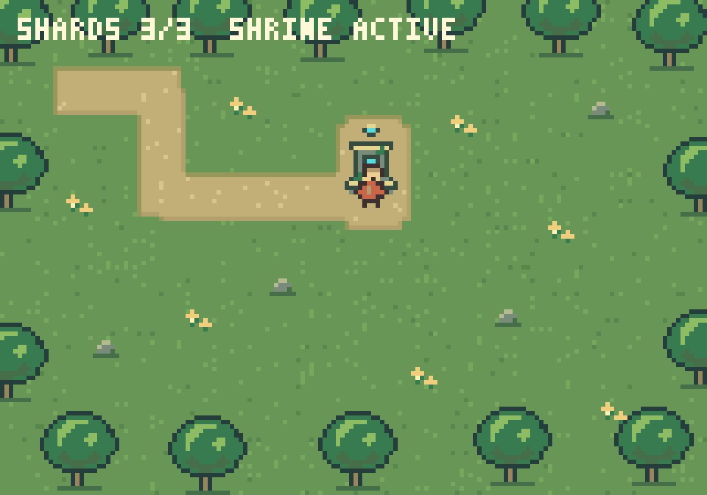

# Titan

Titan is an experimental Rust game engine for a workflow where humans direct
agents to build and iterate on games. Edit ordinary Rust, run the game, inspect
and control it through structured tooling, and verify the result without a
graphical editor.

**[Play in your browser](https://titan-engine.github.io/titan/)** ·
[Build your first game](starters/minimal/README.md) ·
[Contribute](CONTRIBUTING.md) · [Documentation](docs/README.md)

**Early development:** APIs and file formats can change between revisions.
Titan is not production-ready. Pin a Git revision when depending on it; packages
are not distributed through crates.io.

<!-- Use the 8x nearest-neighbor preview: GitHub strips pixelated image CSS. -->


*The example RPG uses generated pixel art and the same game code for native,
browser, and headless runs. [Before/after evidence](docs/art-iteration/README.md).*

Engine crate version: **v0.4.0**. [Milestone notes](docs/releases/v0.4.0.md)
describe that snapshot; the guides below include subsequent development.

## Try the demo

The [hosted demo](https://titan-engine.github.io/titan/) runs the RPG and arena
without installing Rust. To run the RPG locally, install stable Rust with Cargo
and Git. Native development workflows support macOS and
Linux. The interactive demo requires a working graphics backend and windowing
session; the headless replay does not require a GPU.

```sh
git clone https://github.com/titan-engine/titan.git
cd titan
cargo run --locked --example play_rpg
```

Move with arrow keys or W A S D. Collect three shards to activate the shrine.
Close the window to exit. Both games support [snapshot-backed interactive replay](docs/replay.md);
try the [RPG recording and playback controls](docs/rpg-replay.md).

For a headless replay and reference capture:

```sh
cargo run --locked --example procedural_rpg
```

This writes `target/titan/procedural-rpg.ppm`. The reference run completes after
11 ticks with three collected shards, an active shrine, and RGBA checksum
`f7a298f62ad75c1c`.

To build the browser demo yourself, also install Python 3:

```sh
python3 scripts/build-browser.py
python3 -m http.server 8000 --bind 127.0.0.1 --directory web
```

Open [localhost:8000/play/](http://127.0.0.1:8000/play/) and click Play.
The build script installs matching `wasm-bindgen` tooling under `target/titan`
and adds the Rust WASM target when needed. Browser rendering requires WebGPU or
WebGL2 with floating-point color attachments. Node.js is also needed to run the
WASM acceptance tests. See [rendering](docs/rendering.md) and
[browser inspection](docs/browser.md) for details. Stop the local server with
Ctrl-C when finished.

## Try the independent arena game

```sh
cargo run --manifest-path games/arena/Cargo.toml --bin play
```

Avoid the coral pursuers for 20 seconds. Move with arrows/WASD; R restarts.
For a macOS app bundle, browser play and deterministic replay commands, see the
[arena README](games/arena/README.md). The [independent exercise](docs/arena-exercise.md)
records a failed run, diagnosis, tuning fix and native/browser evidence.
The arena also supports [live-player inspection and recording replay](docs/arena-replay.md)
in its native window and browser canvas.

## Inspect and control a running game

Titan's central loop is **edit → run → inspect → replay → verify**. Games expose
named entities, typed fields, commands, and captures so tools can check what
actually happened. Try the same interface an agent uses:

Start a paused runtime:

```sh
cargo run --locked --example procedural_rpg -- --serve --instance demo
```

From another terminal in the repository:

```sh
cargo run --locked -p titan-cli -- --format json --instance demo capabilities
cargo run --locked -p titan-cli -- --format json --instance demo entities
cargo run --locked -p titan-cli -- --format json --instance demo input 1 --actions '{"right":{"kind":"button","value":true}}'
cargo run --locked -p titan-cli -- --format json --instance demo step 1
cargo run --locked -p titan-cli -- --format json --instance demo capture
```

This submits movement for the first tick, advances that tick, and captures the
result. Stepping alone does not supply movement input. The
[CLI guide](docs/cli.md) shows input injection, command invocation, and validated
field edits. Native inspection uses authenticated loopback discovery. Field
mutation requires explicit opt-in; browser inspection starts read-only.
Runtime and CLI failures can produce bounded diagnostic bundles with state,
recent input, and captures. Stop the runtime with Ctrl-C.

## What works today

- A custom ECS with generational entities, typed systems and queries, bundles,
  validated access, and deterministic deferred structural changes.
- Fixed-tick input and replay, exact software rendering, and native/browser
  GPU sprite rendering.
- Structured inspection, game commands, validated component fields, captures,
  and native diagnostic bundles.
- Entity-based text and pointer buttons, shared by the arena HUD and RPG quest
  display, with inspectable content and positions.
- A procedural RPG with native and actual-WASM control-loop tests, semantic
  assertions, and verified software/GPU captures.

The [standalone starter](starters/minimal/README.md) can be copied outside this
checkout and uses public Titan APIs for native, browser and headless runs.
An [independently built arena-survival demo](games/arena/README.md) now exercises
that workflow, with deterministic native and browser checks. Windows native discovery, production stability,
an editor, and a general asset pipeline are outside the current supported scope.

## Development and contributions

Titan is maintained by [Olle Lukowski (@olukowski)](https://github.com/olukowski).
Contributions with or without AI tools are welcome. Help with documentation,
examples, bug reports, testing, or focused engine work.

- **Start here:** [contribution guide](CONTRIBUTING.md), including setup, checks,
  and how to open a PR.
- **Choose work:** [good first issues](https://github.com/titan-engine/titan/issues?q=is%3Aissue%20is%3Aopen%20label%3A%22good%20first%20issue%22)
  and [help wanted](https://github.com/titan-engine/titan/issues?q=is%3Aissue%20is%3Aopen%20label%3A%22help%20wanted%22).
- **Ask or discuss:** [GitHub Discussions](https://github.com/titan-engine/titan/discussions).
- **See the direction:** [vision](docs/vision.md) and
  [public development board](https://github.com/orgs/titan-engine/projects/1).

Comment on an unassigned Ready issue to coordinate with the maintainer. Proposed
issues need scope discussion first. You do not need access to private planning
sessions or project administration to participate.

## Documentation

The [documentation index](docs/README.md) groups guides by trying Titan, building
a game, understanding the architecture, and contributing. Verification reports
and historical milestone evidence have their own section.

## License

Licensed under either the [MIT license](LICENSE-MIT) or the
[Apache License, Version 2.0](LICENSE-APACHE), at your option.
