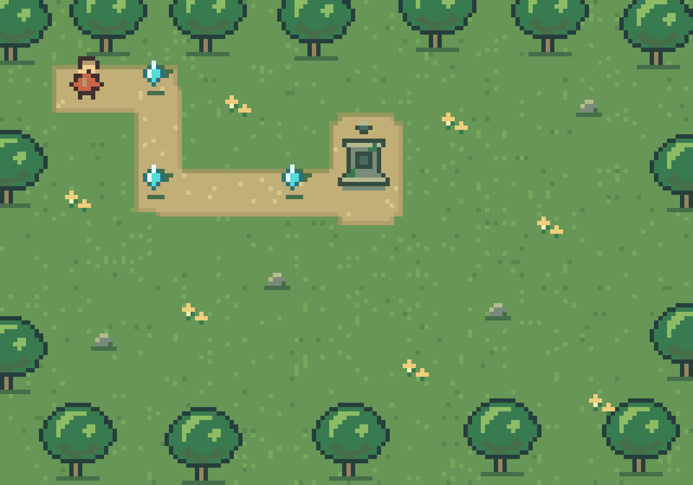

# Titan

Titan is an experimental Rust game engine for a workflow where humans direct
agents to build and iterate on games. Edit ordinary Rust, run the game, inspect
and control it through structured tooling, and verify the result without a
graphical editor.

**Early development:** APIs and file formats can change between revisions.
Titan is not production-ready. Pin a Git revision when depending on it; packages
are not distributed through crates.io.



*The example RPG uses generated pixel art and the same game code for native,
browser, and headless runs. [Before/after evidence](docs/art-iteration/README.md).*

## Try the demo

Install current stable Rust with Cargo. The project is tested locally with Rust
1.98.1; CI checks stable Rust. Native development workflows support macOS and
Linux. The interactive demo requires a working graphics backend and windowing
session; the headless replay does not require a GPU.

```sh
git clone https://github.com/titan-engine/titan.git
cd titan
cargo run --locked --example play_rpg
```

Move with arrow keys or W A S D. Collect three shards to activate the shrine.
Close the window to exit.

For a headless replay and reference capture:

```sh
cargo run --locked --example procedural_rpg
```

This writes `target/titan/procedural-rpg.ppm`. The reference run completes after
11 ticks with three collected shards, an active shrine, and RGBA checksum
`190a92085def5677`.

For the browser demo, also install Python 3:

```sh
python3 scripts/build-browser.py
python3 -m http.server 8000 --bind 127.0.0.1 --directory web
```

Open [localhost:8000/play/](http://127.0.0.1:8000/play/) and click Play.
The build script installs matching `wasm-bindgen` tooling under `target/titan`
and adds the Rust WASM target when needed. Browser rendering requires WebGPU or
WebGL2 with floating-point color attachments. Node.js is also needed to run the
WASM acceptance tests. See [rendering](docs/rendering.md) and
[browser inspection](docs/browser.md) for details. Stop the local server with
Ctrl-C when finished.

## Inspect and control a running game

Start a paused runtime:

```sh
cargo run --locked --example procedural_rpg -- --serve --instance demo
```

From another terminal in the repository:

```sh
cargo run --locked -p titan-cli -- --format json --instance demo capabilities
cargo run --locked -p titan-cli -- --format json --instance demo entities
cargo run --locked -p titan-cli -- --format json --instance demo step 11
cargo run --locked -p titan-cli -- --format json --instance demo capture
```

Stepping advances time; it does not supply movement input. The
[CLI guide](docs/cli.md) shows input injection, command invocation, and validated
field edits. Native inspection uses authenticated loopback discovery. Field
mutation requires explicit opt-in; browser inspection starts read-only.
Runtime and CLI failures can produce bounded diagnostic bundles with state,
recent input, and captures. Stop the runtime with Ctrl-C.

## What works today

- A custom ECS with generational entities, typed systems and queries, bundles,
  validated access, and deterministic deferred structural changes.
- Fixed-tick input and replay, exact software rendering, and native/browser
  GPU sprite rendering.
- Structured inspection, game commands, validated component fields, captures,
  and native diagnostic bundles.
- A procedural RPG with native and actual-WASM control-loop tests, semantic
  assertions, and verified software/GPU captures.

The [standalone starter](starters/minimal/README.md) can be copied outside this
checkout and uses public Titan APIs for native, browser and headless runs.
Milestone 2 is using it to build an independent arena-survival demo. Windows native discovery, production stability,
an editor, and a general asset pipeline are outside the current supported scope.

## Development and contributions

Small bug reports and focused fixes are welcome. Include the revision, platform,
reproduction steps, and relevant diagnostic output. Inspect artifacts before
sharing them: game state and application logs may contain your own data. Discuss
larger architectural changes against the current plan before implementing them.

The main checks are:

```sh
cargo fmt --all --check
cargo test --workspace --all-targets
cargo clippy --workspace --all-targets --all-features -- -D warnings
```

[The implementation plan](docs/implementation-plan.md) includes WASM and
separate-process acceptance commands. Keep examples and documentation consistent
with API changes. GPU integration tests are opt-in; normal tests run without a
GPU.

## Documentation

- [Vision and principles](docs/vision.md)
- [Current milestone: starter and arena demo](docs/second-milestone.md)
- [Implementation plan](docs/implementation-plan.md)
- [Open design questions](docs/open-questions.md)
- [Copy the minimal game starter](starters/minimal/README.md)
- [Starter boundary audit](docs/starter-audit.md)
- [ECS authoring](docs/ecs-authoring.md)
- [CLI workflow](docs/cli.md)
- [In-process inspection](docs/inspection.md)
- [Browser inspection](docs/browser.md)
- [Interactive rendering](docs/rendering.md)
- [Repository-local agent workflow](.agents/skills/titan-workflow/SKILL.md)

## License

Licensed under either the [MIT license](LICENSE-MIT) or the
[Apache License, Version 2.0](LICENSE-APACHE), at your option.
