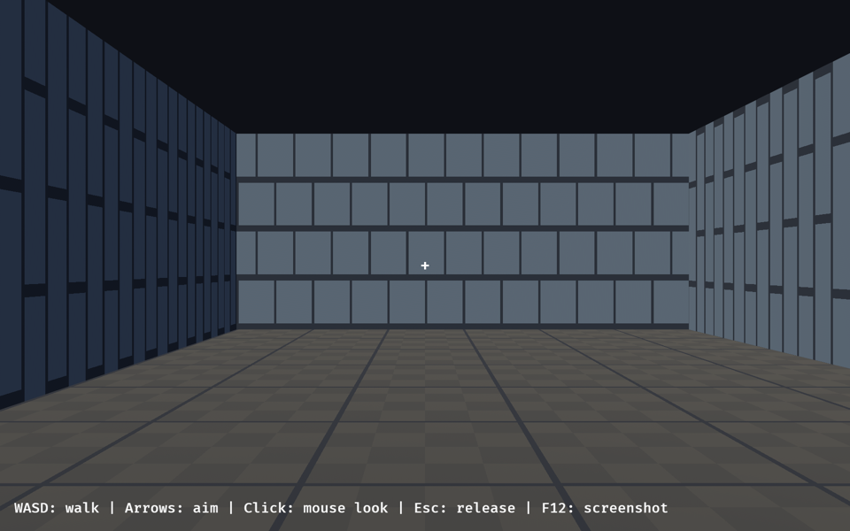
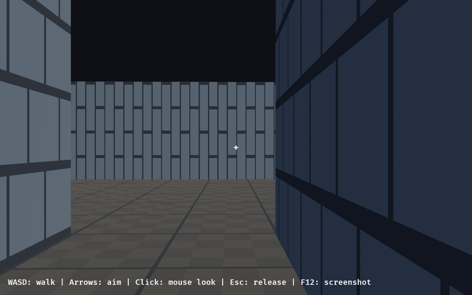

# Doom-style Titan demo: walkable foundation

A small industrial room-and-corridor map, first-person walking and aiming, and
shared human/scripted controls. This is the foundation for the Titan demo, not
a full game: there is no combat, enemy, pickup, door, or Doom file compatibility.
The collision code is intentionally local to this demo, not a physics engine.

## Run

From the repository root:

```sh
cargo run -p titan_doom
```

Use the repository's Rust toolchain and, on Linux, install the dependencies in
[the Linux dependency guide](../../docs/linux_dependencies.md). The rendered
binary needs a GPU and a desktop session. It opens the bundled level immediately.

- **W/A/S/D:** forward, left, backward, right. Diagonal speed is capped.
- **Arrow keys:** aim left/right/up/down without grabbing the pointer.
- **Left click:** capture the pointer for mouse aiming.
- **Escape:** release the pointer. Losing focus also releases it and stops input.
- **F12:** save `titan-doom.png` in the current directory.
- Close the window to quit.

Explore north from spawn, then turn east through the opening between the two
chambers. There is no jumping or vertical movement. The circular player radius
is 0.2 world units, speed is 3 units/second, and eye height is 0.85 units.

To load an edited level or capture a reproducible starting view:

```sh
cargo run -p titan_doom -- --level demos/doom/levels/industrial.ron
cargo run -p titan_doom -- --capture /tmp/titan-doom.png
```

`--capture` requests a screenshot after 120 presentation frames and exits once
captured. Allow the window to render; this is not a headless screenshot command.
The committed image below was captured from the running macOS/Metal build and
visually checked for floor/wall textures, perspective, and controls. There is
no before image because this is a new demo. The textures are original procedural
32×32 placeholders generated in `src/main.rs`; no external game assets are used.



Walking and arrow-key aiming were also exercised through the running window's
keyboard input, and F12 captured the view toward the second chamber:



## Level format

[`levels/industrial.ron`](levels/industrial.ron) is the complete bundled map.
Geometry and object placements are separate:

```ron
(
    rows: [
        "#####",
        "#...#",
        "#...#",
        "#...#",
        "#####",
    ],
    objects: [
        (id: "player-spawn", kind: Spawn, position: (2.5, 2.5), yaw: 0.0),
        (id: "landmark", kind: Marker, position: (3.5, 2.5), yaw: 0.0),
    ],
)
```

- `#` is a solid, axis-aligned unit wall. `.` is a flat floor at height zero.
  Walls render 2.6 units high. The outside of the grid is always solid.
- Rows increase in world Z; columns increase in X. A cell at `(x, z)` spans
  `[x, x+1] × [z, z+1]`, so its center is `(x+0.5, z+0.5)`.
- Object positions are world coordinates `(x, z)`. Yaw is radians: zero faces
  north (-Z), positive turns left, and `-1.5707963` faces east (+X).
- `Spawn` supplies the initial player position and heading. Exactly one is
  required. `Marker` is a passive authored landmark with no collision,
  interaction, or rendered prop yet.
- IDs are unique, nonempty printable ASCII strings, no whitespace, at most
  64 bytes. Preserve an object's ID when moving it; never use runtime entity
  IDs for authored identity. Observation reports IDs in sorted order.

Parsing rejects RON syntax errors (including line/column), unknown fields/kinds,
unsupported cells, ragged rows, dimensions outside 3–128 cells, open borders,
more than 1024 objects, invalid/duplicate IDs, non-finite poses, placements off
floor, missing/extra spawns, and insufficient spawn clearance. Semantic errors
identify the relevant cell, row, or object where applicable. The launcher returns
these errors before creating a window. Disconnected floor regions are allowed;
this foundation does not require every marker to be reachable.

## Gameplay and presentation boundary

`src/lib.rs` contains the level representation and `GameplayPlugin`. It has no
rendering, filesystem loading, OS input, asset, or window requirement. The
optional `render` feature enables only the windowed binary and presentation in
`src/main.rs`. No engine internals were modified.

Install a validated `Level` resource before `GameplayPlugin`. Gameplay executes
in `FixedUpdate` at **60 Hz**, one 1/60-second movement step per schedule run.
Configure `Time<Fixed>::from_hz(FIXED_HZ)` for a normal app. If a test deliberately
invokes `FixedUpdate` directly, each invocation still means one supported tick;
changing the clock does not change the simulation's step size.

The shared `GameplayActions` resource contains:

- `movement: Vec2`: held local axes (X strafe right, Y forward), length capped
  at one. Held movement persists until replaced, including when a frame runs
  multiple fixed steps.
- `look_delta: Vec2`: accumulated yaw/pitch radians, consumed once at the next
  fixed tick, before movement. Accumulate rather than overwrite pointer deltas
  on frames without a fixed tick. Pitch is clamped; yaw is wrapped.

Human input writes these exact actions before the fixed loop. Scripted tests
write the same resource; there is no separate scripted movement implementation.
Aim does not change walking height. Non-finite action values are ignored.
Collision uses a circle against nearby wall cells, resolving X then Z in a
stable order so blocked motion can slide along a wall. Steps are bounded to
avoid tunneling through walls, and movement approaches contact rather than
leaving a step-sized gap.

`PlayerState` and `GameplayActions` are reflected resources registered by the
plugin. `GameplayObservation::capture(world)` returns the pose, completed tick
count, and sorted stable authored IDs without presentation or runtime identities.
There is no gameplay randomness in this foundation. The replay guarantee is
limited to the supported scenarios in the same build/platform, not universal
cross-platform floating-point determinism.

Create a fresh app/`Sim` to reset the level, player, actions, and tick count.
Replacing `Level` in an already-running app does **not** reset the player. There
is no win/loss or combat event API until the subsequent gameplay work.

## Headless verification

No renderer, GPU, desktop, LLM, or credentials are required:

```sh
cargo test -p titan_doom --no-default-features
cargo clippy -p titan_doom --no-default-features --all-targets -- -D warnings
```

[`tests/movement.rs`](tests/movement.rs) uses the existing `titan_test::Sim`
harness to drive the real app's fixed schedule at controlled 60 Hz:

```rust,ignore
let mut sim = titan_test::Sim::new(|app| {
    app.insert_resource(Level::demo()).add_plugins(GameplayPlugin);
});
sim.world_mut().resource_mut::<GameplayActions>().movement = Vec2::Y;
sim.run_ticks(80);
let observed = GameplayObservation::capture(sim.world());
assert!((observed.player.position - Vec2::new(3.5, 5.5)).length() < 0.001);
```

The scenario walks from spawn through the corridor into the second room,
checks intermediate positions and tick counts, and compares observations from
five independent runs. Another scenario holds movement against a closed room
corner for 1200 ticks. Timing tests cover frames with zero or multiple fixed
steps, retaining pending aim and consuming it exactly once. Unit tests also cover sliding, circular corner clearance,
large-displacement wall tunneling, diagonal/analog speed, aiming and look
consumption, non-finite actions, malformed levels, and stable identity despite
unrelated ECS entity allocation. CI tests the no-default-feature combination
explicitly; workspace CI covers the rendered build.

For presentation changes, also run the windowed demo and inspect a fresh capture.
The compiler and headless tests cannot establish that a rendered view is correct.
