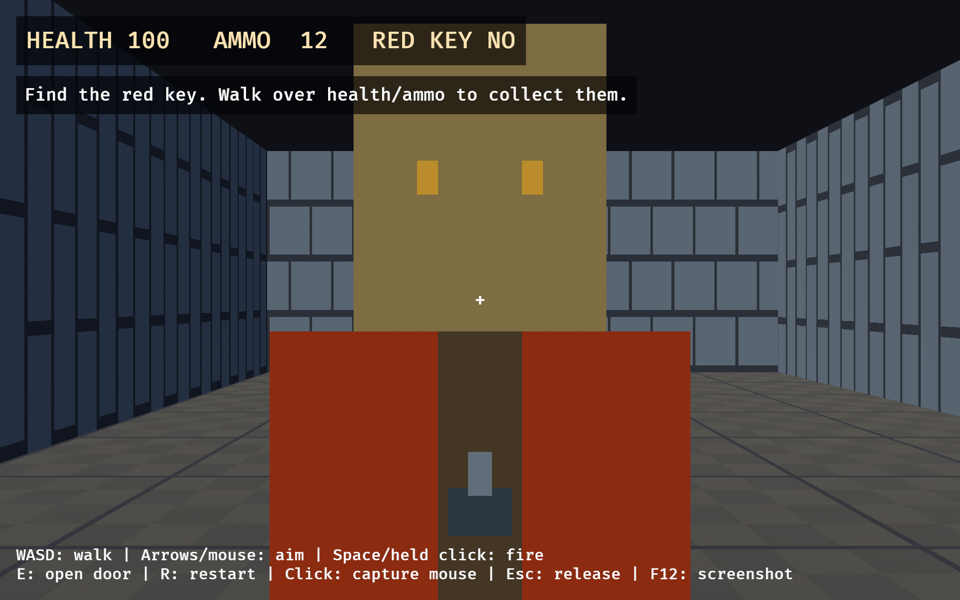
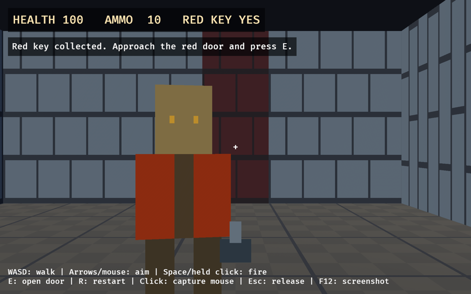
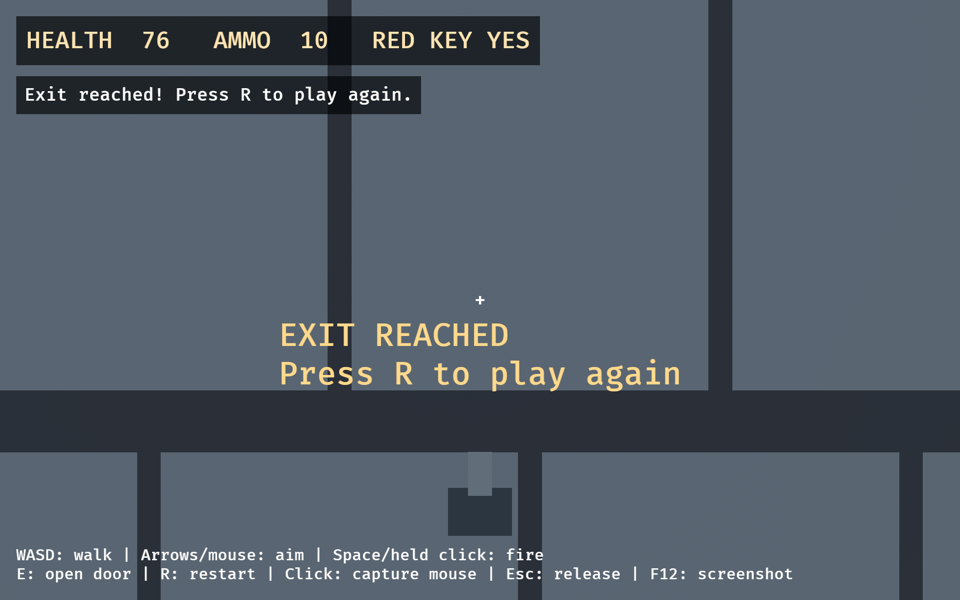
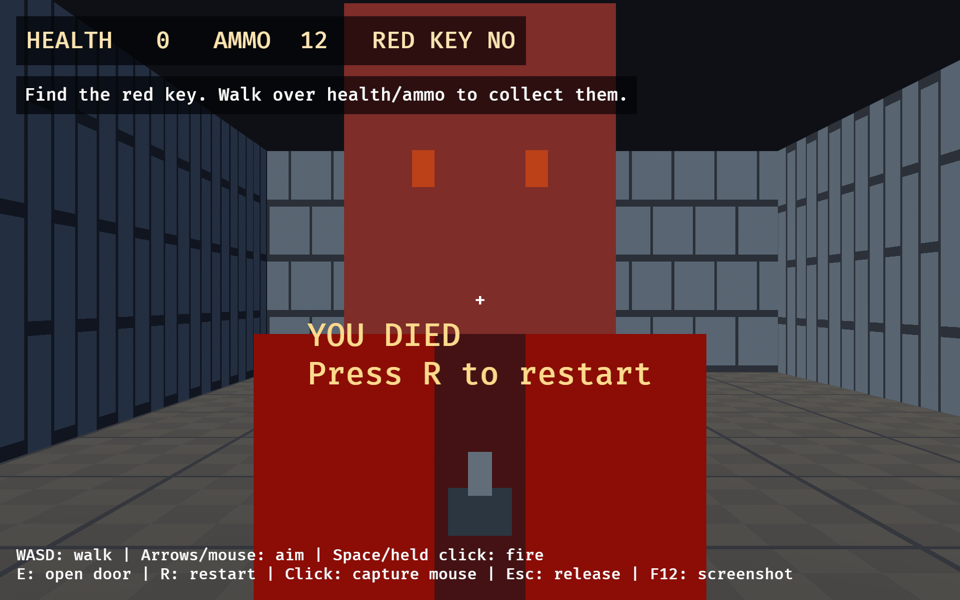
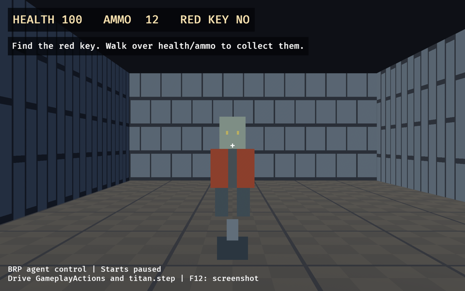
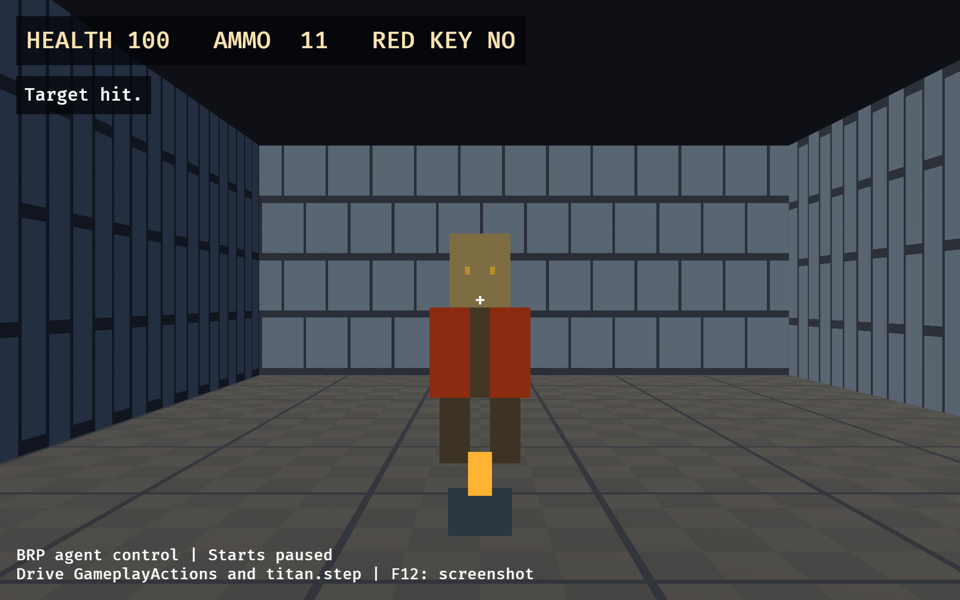
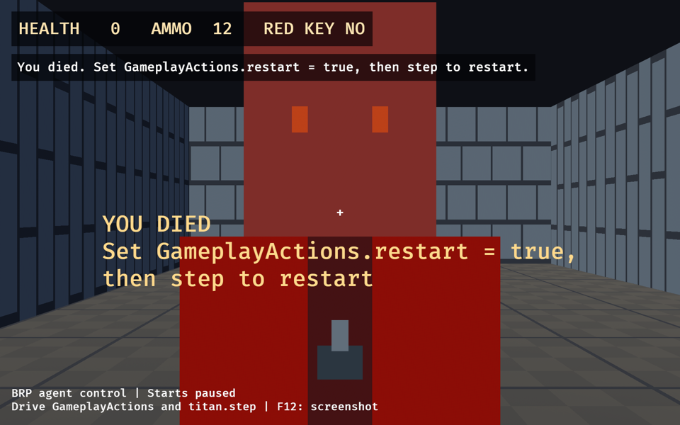

# Titan industrial combat demo

A small first-person game with an authored industrial level, one hitscan weapon,
placeholder billboard sentries, health/ammo pickups, a red key and locked door,
and an exit. Human input and headless tests drive the same fixed-tick gameplay
API. Collision and enemy behavior are intentionally local to this demo, not a
physics engine or general FPS framework. There is no Doom file compatibility,
branding, or original game asset use.

## Run and play

From the repository root:

```sh
cargo run -p titan_doom
```

Use the repository's Rust toolchain and, on Linux, install the dependencies in
[the Linux dependency guide](../../docs/linux_dependencies.md). The rendered
binary needs a GPU and a desktop session. It opens the bundled level immediately.

| Input | Action |
| --- | --- |
| W/A/S/D | Walk forward/left/backward/right; diagonal speed is capped |
| Arrow keys | Aim left/right/up/down without capturing the pointer |
| Left click | Capture the pointer for mouse aiming; the capture click does not fire |
| Space or held left mouse button after capture | Fire repeatedly, subject to ammo and cooldown |
| E | Interact with a nearby door while facing it |
| R | Restart from the authored spawn, during play or after death/win |
| Escape | Release the pointer |
| F12 | Save `titan-doom.png` in the current directory |

Losing focus releases the pointer and clears pending/held input. Close the window
to quit. There is no jumping or vertical movement. The circular player radius is
0.2 world units, walking speed is 3 units/second, and eye height is 0.85 units.

### The gameplay loop

Start facing north (-Z). Shoot the corridor sentry, then head east through the
opening into the second chamber. Defeat the key guard and walk over the red key
in that chamber. Approach the red door to the north, face it, and press E. Walk
through the opened doorway to the green exit to win. The HUD reports health,
ammo, red-key possession, and interaction outcomes. Death and victory display
an R-to-restart prompt.

- Start with **100 health and 12 rounds**. The weapon deals **25 damage** per
  valid hit, has a **15-tick cooldown** (four shots/second), and a 32-unit range.
  Each sentry starts with 50 health. Aim at its chest; vertical aiming matters.
  Shots and sight traverse only the grid cells touched by each ray, conservatively
  including corner contacts and both sides of a grid-boundary-aligned ray.
- Walls and closed doors stop shots and enemy line of sight. Sentries idle
  without a clear nearby view, chase visible players, attack at close range,
  and leave a flattened gray corpse when killed. Their sprite turns orange
  while chasing and red while attacking. Navigation is direct pursuit with
  wall sliding, not pathfinding.
- Walk within 0.5 units of an unobstructed pickup to collect it: white packs
  with a red cross restore **30 health**, yellow boxes add **12 rounds**, and
  the red key unlocks red doors. Health caps at 100 and ammo at 99. Health/ammo
  pickups remain available when already at their respective cap; a consumed
  pickup disappears and cannot apply again until restart.
- Door interaction requires facing a closed door within 1.5 units. Without the
  red key, the HUD explains that it is locked; with the key, the entire red
  door block disappears. The key is reusable, not consumed by opening a door.
- Walking within 0.5 units of an unobstructed green exit wins. Death/win stops
  simulation progress until restart. R restores the spawn pose, health, ammo,
  all object states, pending actions, cooldowns, and tick count.

To load an edited level or capture the starting view:

```sh
cargo run -p titan_doom -- --level demos/doom/levels/industrial.ron
cargo run -p titan_doom -- --capture /tmp/titan-doom.png
```

`--capture` requests a screenshot after 120 presentation frames and exits only
with success after the image is saved. Conversion errors, unsupported file
extensions, write failures, or closing the window before the image is saved
produce a nonzero exit status and a diagnostic. Allow the window to render;
this is not a headless screenshot command. Gameplay still advances while the
window renders, so this is a presentation capture, not a controlled-tick replay.

## Presentation and assets

All assets are original procedural placeholders generated in `src/main.rs`:
32×32 nearest-filtered wall/floor textures and alpha-masked pixel-art billboards
for enemies, health, ammo, the red key, and the green exit. The closed door is a
red full-cell block. A simple screen-space weapon silhouette flashes gold while
the weapon is on cooldown. No third-party assets, downloads, extraction steps,
or external attribution are required. Do not add original Doom assets.

The following before/after captures were taken from running macOS/Metal builds
on an Apple M5 Pro (scaled to 960×600 for documentation). Keyboard controls were
also exercised to fire at the corridor sentry, collect the red key, open the red
door, reach the exit, die, and restart. This is local presentation verification,
not a claim of testing every graphics backend.










For future presentation changes, run the windowed demo and inspect fresh captures
with F12 or `--capture`. Compilation and headless tests cannot establish that
rendering is correct.

## Level format

[`levels/industrial.ron`](levels/industrial.ron) is the complete bundled map.
Geometry and object placements are separate:

```ron
(
    rows: [
        "#######",
        "#.....#",
        "#.....#",
        "#.....#",
        "#######",
    ],
    objects: [
        (id: "player-spawn", kind: Spawn, position: (2.5, 2.5), yaw: 0.0),
        (id: "guard", kind: Enemy, position: (4.5, 1.5), yaw: 0.0),
        (id: "key", kind: RedKey, position: (4.5, 3.5), yaw: 0.0),
        (id: "door", kind: RedDoor, position: (5.5, 2.5), yaw: 0.0),
        (id: "finish", kind: Exit, position: (5.5, 1.5), yaw: 0.0),
    ],
)
```

This tiny format example is not a designed gameplay route; use the bundled map
for the complete combat/key/door/exit loop.

- `#` is a solid, axis-aligned unit wall. `.` is a flat floor at height zero.
  Walls render 2.6 units high. The outside of the grid is always solid.
- Rows increase in world Z; columns increase in X. A cell at `(x, z)` spans
  `[x, x+1] × [z, z+1]`, so its center is `(x+0.5, z+0.5)`.
- Object positions are world coordinates `(x, z)`. Yaw is radians: zero faces
  north (-Z), positive turns left, and `-1.5707963` faces east (+X).
- Exactly one `Spawn` supplies the initial player pose. `Marker` is a passive,
  invisible landmark. Other kinds are `Enemy`, `Health`, `Ammo`, `RedKey`,
  `RedDoor`, and `Exit`; their behavior and initial stats are defined by gameplay.
- A `RedDoor` must sit at a cell center. Its closed state makes that entire cell
  solid, regardless of yaw, and it cannot share a cell with another object.
  Place surrounding walls so the player cannot bypass a required door.
- IDs are unique, nonempty printable ASCII strings, without whitespace, at most
  64 bytes. Preserve IDs when moving objects; do not use runtime entity IDs as
  authored identity. Observation reports IDs and gameplay objects in sorted order.

Parsing rejects RON syntax errors (including line/column), unknown fields/kinds,
unsupported cells, ragged rows, dimensions outside 3–128 cells, open borders,
more than 1024 objects, invalid/duplicate IDs, non-finite poses, placements off
floor, missing/extra spawns, insufficient spawn/enemy clearance, and invalid or
overlapping door cells. The spawn also needs clearance from closed doors.
Semantic errors identify the relevant cell, row, or object where applicable.
The launcher returns these errors before creating a window. Disconnected floor
regions are allowed; validation does not prove a level is completable.

## Gameplay and presentation boundary

`src/lib.rs` contains level representation, actions, observations, and
`GameplayPlugin`; `src/combat.rs` contains combat and interaction rules. Neither
requires rendering, filesystem loading, OS input, assets, or a window. The
optional `render` feature enables the windowed binary and `src/main.rs` only.
Camera, light, HUD, and weapon hierarchy use Bevy Scene Notation (`bsn_list!` and
`Children`); geometry and authored-object visuals are spawned procedurally.
Visuals are matched to gameplay objects by stable string ID. Presentation names
and ECS entities do not replace those IDs or participate in mechanics.

Install a validated `Level` before `GameplayPlugin`. Gameplay executes in
`FixedUpdate` at **60 Hz**, one 1/60-second step per schedule run. Configure
`Time<Fixed>::from_hz(FIXED_HZ)` in a normal app. A test invoking `FixedUpdate`
directly still advances one supported tick per invocation; changing the clock
does not change the simulation step size.

### Shared action API

`GameplayActions` is a reflected resource:

- `movement: Vec2`: held local axes (X strafe right, Y forward), length capped
  at one. Held movement persists until replaced, including multi-tick frames.
- `look_delta: Vec2`: accumulated yaw/pitch radians, consumed once at the next
  fixed tick before movement. Accumulate rather than overwrite pointer deltas
  on frames without a fixed tick. Pitch is clamped; yaw is wrapped.
- `fire: bool`: held trigger, firing whenever ammo/cooldown permit.
- `interact: bool`: pending door interaction, consumed once by the next tick.
- `restart: bool`: pending clean restart, consumed once by the next tick; takes
  precedence over other actions and is available in every game phase.

Human input writes these actions before the fixed loop. E/R use OR accumulation
so a press survives presentation frames with no gameplay tick. The mouse-capture
frame discards pre-capture motion and does not fire; held mouse firing begins on
subsequent captured frames. Scripted callers write the same resource, without a
second movement/combat path. Aim does not change walking height. Non-finite
movement/aim inputs are ignored. Circular collision resolves X then Z in a
stable order and bounds steps to prevent tunneling through walls/closed doors.

### Observations, events, and reset

The plugin registers reflected `PlayerState`, `GameplayActions`, `CombatState`,
and the gameplay object/state/event types. `GameplayObservation::capture(world)`
returns player pose/tick, sorted authored IDs, and a clone of combat state without
presentation or runtime identities.

`CombatState` exposes:

- `health: u32`, `ammo: u32`, `red_key: bool`;
- `phase: GamePhase` (`Playing`, `Dead`, `Won`) and `weapon_cooldown: u32`;
- `objects: Vec<GameplayObject>`, sorted by stable ID. Each object exposes
  `id`, `kind`, current `position: Vec2`, `health`, `enemy_state`
  (`Idle`, `Chase`, `Attack`, `Dead`), `cooldown`, and `active`. A door is active
  while **closed**; consumed pickups and dead enemies are inactive;
- `events: Vec<GameplayEvent>` from the **latest tick only**, replaced each tick.
  Each event has `tick: u64`, `object_id: Option<String>`, and `outcome`.

Outcomes are `ShotHit`, `ShotBlocked`, `ShotMiss`, `EmptyAmmo`, `EnemyKilled`,
`PlayerDamaged`, `PlayerDied`, `HealthCollected`, `AmmoCollected`, `KeyCollected`,
`MissingKey`, `DoorOpened`, `NoDoor`, `ExitReached`, and `Restarted`. Inspect or
copy events after each controlled tick if a scenario needs a complete trace;
several fixed steps can otherwise replace an important outcome before observation.
The windowed HUD observes every `FixedPostUpdate` and retains useful messages
briefly, prioritizing pickups/door results over routine shot feedback. This
presentation history is not part of reflected gameplay state.

Set `actions.restart = true` and run a tick for a clean reset. Restart returns
player tick to zero and emits `Restarted` at tick zero. Creating a fresh app/`Sim`
also initializes clean state. Replacing `Level` in an existing app does **not**
automatically reset it; request restart when replacing a level so poses and
objects adopt the new geometry. Restart uses the installed level. Changing level geometry
at runtime is not supported by the windowed presentation; relaunch with `--level`.

Gameplay uses no randomness. Replay guarantees are limited to supported
scenarios in the same build/platform, not universal cross-platform floating-point
determinism. Advanced navigation, additional weapons/enemy types, multiplayer,
and jumping/stairs are out of scope.

## Agent control over BRP (opt-in)

The default build serves **no BRP**. Enable `remote` explicitly:

```sh
cargo run -p titan_doom --features remote -- --brp-port 15702
# For MCP lifecycle management, compile first rather than compiling at launch:
cargo build -p titan_doom --features remote
cargo build -p titan_mcp
```

The single gameplay-world listener is always **127.0.0.1**, never a wildcard or
network address. The renderer is not exposed over BRP, and no second listener
is opened at upstream BRP's default render port 15703.
`--brp-port` accepts 1–65535 and defaults to 15702; choose an unused port and
match the MCP URL. BRP has no authentication and allows powerful world/file
operations. Use only with trusted local agents, do not forward/expose the port,
and stop the game when done. `remote` installs Bevy's `RemotePlugin` and
`RemoteHttpPlugin`, plus `TitanRemotePlugin`. `render + remote` enables Titan's
screenshot token/status methods; `--no-default-features --features remote`
provides the same gameplay/time-control plugins without rendering.

Remote builds start **paused** and give agents exclusive control of
`GameplayActions`: the keyboard/mouse gameplay adapter is disabled, including
its focus-loss reset. HUD feedback and death/win prompts name the corresponding
`GameplayActions` fields and a step instead of the disabled E/R keys.
F12/window close still work. Build without `remote` to play with human controls.
No gameplay rules or action fields change.

### MCP setup and walkthrough

Put this in the MCP client's `.mcp.json`, replacing every absolute path (and
adding `.exe` on Windows). Adjust executable paths for `CARGO_TARGET_DIR`:

```json
{
  "mcpServers": {
    "titan": {
      "command": "/absolute/path/to/titan/target/debug/titan_mcp",
      "args": [
        "--url", "http://127.0.0.1:15702",
        "--game-dir", "/absolute/path/to/titan",
        "--game-cmd", "[\"/absolute/path/to/titan/target/debug/titan_doom\",\"--brp-port\",\"15702\"]",
        "--build-cmd", "[\"cargo\",\"build\",\"-p\",\"titan_doom\",\"--features\",\"remote\"]"
      ]
    }
  }
}
```

Use these MCP tools in order (arguments shown as JSON):

1. `launch_game {}` then `game_status {}`: the process is owned/running and
   virtual time is paused.
2. `get_resource {"resource":"titan_doom::PlayerState"}` and
   `get_resource {"resource":"titan_doom::combat::CombatState"}`. The latter
   includes stable object IDs and latest-tick events. This is **debug-mode**
   inspection, not screenshot-only/player-visible playtesting.
3. `set_resource {"resource":"titan_doom::GameplayActions","value":
   {"movement":[0,1],"look_delta":[0,0],"fire":false,"interact":false,"restart":false}}`.
   Write actions, **not** `PlayerState`, `CombatState`, raw input, or transforms.
4. `step {"frames":6}` then query `PlayerState` again: six playing ticks and
   0.3 units of forward movement in unobstructed space. `step` waits until all
   pending frames finish and leaves virtual time paused.
5. Clear held actions with `set_resource` (same object, `movement:[0,0]`), then
   `screenshot {}`. Keep the native window visible; capture requires rendering.
6. `stop_game {}`. `restart_game {}` starts a fresh paused game; use
   `restart_game {"rebuild":true}` after changing demo code.

A recorded macOS/Metal MCP smoke session launched on port 15703, queried state,
set forward movement plus held fire, stepped six frames, cleared held actions,
captured the primary window, and stopped the owned process. Player tick advanced
0 → 6, Z moved 9.5 → 9.2, ammo changed 12 → 11, and the corridor sentry's health
changed 50 → 25. These captures were returned by MCP's `screenshot` tool, then
scaled to 960×600 for documentation; this is a control/connectivity smoke test,
not a claim of autonomous level completion (#30).

<details>
<summary>MCP screenshots before and after the six-frame action</summary>





A separate session stepped 660 idle frames to let the sentry kill the player,
then followed the displayed action/step prompt: `GameplayActions.restart = true`
and one step restored health 100, phase `Playing`, and player tick zero.



</details>

To restart gameplay without relaunching, set `GameplayActions.restart` to true
and step one tick. One-shot aim/interact/restart are consumed by a fixed tick;
held movement/fire persist until explicitly replaced. Events are latest-tick
only, so step one tick at a time to retain an action/outcome trace.

### What a Titan step means

`titan.step` advances **app frames**, each adding `dt_secs` of virtual time;
it does not directly invoke `FixedUpdate`. The demo's fixed clock is configured
at `FIXED_HZ = 60`, and each fixed tick always simulates 1/60 second. With the
MCP/Titan default `dt_secs = 1/60`, N frames advance N gameplay ticks while
playing. `PlayerState.tick` freezes on death/win and resets on restart.

In general, the number of fixed ticks is the whole timesteps in the existing
fixed-clock overstep plus `frames * dt_secs`; fractional overstep carries into
the next request. For example, from a clean paused clock, two frames at 1/120
second run one tick, and one frame at 1/30 runs two ticks. A shorter single
frame may run no tick and leave one-shot actions pending. Float-to-duration
rounding can accumulate at very large step counts; inspect `PlayerState.tick`
when exact tick budgets matter. Pause freezes virtual/fixed time, but app frames,
BRP, and rendering continue. Use one time-controlling client; other clients'
pause/resume requests can cancel a pending step.

## Headless verification

No renderer, GPU, desktop, LLM, or credentials are required:

```sh
cargo test -p titan_doom --no-default-features
cargo test -p titan_doom --no-default-features --features remote
cargo test -p titan_doom --features remote
cargo clippy -p titan_doom --no-default-features --all-targets -- -D warnings
```

[`tests/remote.rs`](tests/remote.rs), enabled by `remote`, starts a child-process
headless demo on an OS-selected loopback port. It reads reflected player/combat
state (including nested objects/events), writes `GameplayActions` over real
HTTP BRP, and verifies startup pause, movement, pause/status/resume, and fixed
timing at full, half, and double dt. The rendered binary additionally checks that
its human input adapter cannot overwrite remote actions, without opening a GPU.

[`tests/movement.rs`](tests/movement.rs) uses the existing `titan_test::Sim`
harness to drive the real fixed schedule at controlled 60 Hz. The same pattern
supports combat and restart:

```rust,ignore
let mut sim = titan_test::Sim::new(|app| {
    app.insert_resource(Level::demo()).add_plugins(GameplayPlugin);
});
sim.world_mut().resource_mut::<GameplayActions>().fire = true;
sim.run_ticks(1);
let observed = GameplayObservation::capture(sim.world());
assert_eq!(observed.combat.ammo, 11);
assert_eq!(observed.player.tick, 1);

sim.world_mut().resource_mut::<GameplayActions>().restart = true;
sim.run_ticks(1);
let reset = GameplayObservation::capture(sim.world());
assert_eq!(reset.player.tick, 0);
assert_eq!(reset.combat.phase, GamePhase::Playing);
assert_eq!(reset.combat.ammo, 12);
```

[`tests/combat.rs`](tests/combat.rs) covers ammo/damage/cooldowns, pitched shots,
nearest-target selection, wall/door shot and sight blocking, enemy chase/attack,
one-time pickups and caps, missing-key/open-door outcomes, death/win freeze,
clean restart, reflection, stable IDs, and a repeated authored-level completion
through the shared actions. Movement regression scenarios use a noncombat
foundation fixture to isolate walking, collision, aiming, and timing behavior
from enemies and closed doors.
The shared Linux-only [Titan workflow](../../.github/workflows/titan.yml) tests
and lints the no-default-feature combination as well as testing all features.
Workspace CI covers the rendered build on all three operating systems.

`cargo test -p titan_doom --bin titan_doom` additionally checks presentation
hierarchy, pending keyboard one-shots, mouse-capture activation/focus loss,
retained HUD feedback, object visibility/reset, and screenshot success/failure
handling without opening a window or creating a GPU
device (rendering dependencies are compiled). For presentation changes, also run
the windowed demo and inspect fresh captures.
