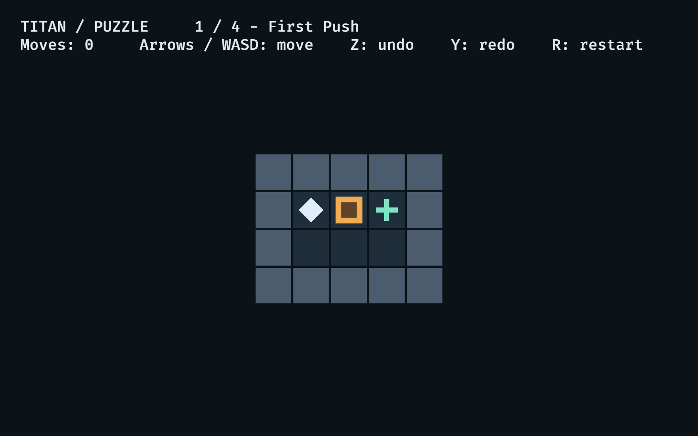

# Titan Puzzle: foundation

A small Sokoban-family push puzzle: walk one cell, push one block, cover every
target. Four starter levels teach pushing, turning, multiple blocks, and routing
around a wall. This is the shared foundation for [#78](https://github.com/titan-engine/titan/issues/78),
not final art, animation, audio, menus, saving, accessibility, or the full level set.

## Run

From the repository root, using the repository's CI-pinned Rust toolchain:

```sh
cargo run -p titan_puzzle
cargo run -p titan_puzzle -- --level demos/puzzle/levels/03-two-deliveries.puzzle
cargo run -p titan_puzzle -- --capture /tmp/titan-puzzle.png
```

A GPU and desktop session are required for the binary. Linux dependencies are
listed in [the dependency guide](../../docs/linux_dependencies.md).

- **Arrow keys / W A S D:** one move per press (no held-key repeat yet).
- **Z / Backspace:** undo. **Y:** redo. **R:** restart.
- **F12:** save `titan-puzzle.png` in the current directory.
- Close the window to quit.

Completing a level shows its solved board, then advances after 1.2 seconds. Undo
or restart during that interval cancels the transition. On the last level the
solved board stays visible; undo and restart still work. Loading a custom file
creates a one-level campaign. The board fits the window (including large custom
levels) and refits on resize. Invalid files fail before creating a window.
`--capture` saves a PNG after 120 presentation frames and exits; save failure or
closing the window early returns a nonzero status. This is not a headless command.



This new demo has no before image. The capture is from the running macOS/Metal
build. Shapes are original procedural placeholders (square blocks, cross targets,
and a diamond player), under the repository's MIT/Apache-2.0 license. No external
art or audio assets are bundled; text uses Bevy's existing default font.

## Parallel ownership / architecture

| Work | Owned files | Shared hooks |
| --- | --- | --- |
| Rules / foundation (#79) | `src/simulation.rs`, `src/level.rs`, `src/lib.rs`, `tests/gameplay.rs` | `Action`, `Game`, `GameplayEvent`, validated `Level` |
| Visuals / feel (#80) | `src/visuals.rs`, future `assets/visuals/` | Read state + independent message reader; never read input |
| Audio (#81) | Add `src/audio.rs`, `assets/audio/` | Independent message reader; never read input |
| UX / accessibility (#82) | `src/ux.rs`, future `src/progress.rs` | Write actions; read state + events; owns transition timing |
| Levels / solver (#83) | `src/content.rs`, `levels/`, future `src/solver.rs`, `tests/solver.rs` | `Level::parse`, pure `Game::step` |

`src/main.rs` only wires plugins, CLI loading, and capture. New presentation
plugins need one wiring line here; coordinate those lines, rather than putting
new systems in the foundation files. Renderer-only modules live in the binary;
`--no-default-features` compiles only the library. There are no edits to upstream
Bevy crates or the Doom demo. The existing `demos/*` workspace glob registers this
package. The shared Titan workflow also checks the renderer-free combination.

### Action contract

`Game::new(Vec<Level>)` requires a nonempty campaign with unique level IDs.
`Game::step(Action)` is a deterministic, synchronous, discrete step returning
`Vec<GameplayEvent>`. It uses integer cells, no elapsed time, ECS entities, RNG,
rendering, filesystem access, or OS input. Identical levels and action sequences
produce exactly equal snapshots and events. `Game` and `BoardState` expose only
read-only accessors; mutations go through actions.

```rust
use titan_puzzle::{Action, Game, content::starter_levels, simulation::Direction};
let mut game = Game::new(starter_levels()).unwrap();
let events = game.step(Action::Move(Direction::Right));
assert!(game.state().complete()); // first starter is a single push
assert_eq!(game.state().moves(), 1);
game.step(Action::Undo);
assert!(!game.state().complete());
```

| Action | Semantics |
| --- | --- |
| `Move(Up/Down/Left/Right)` | Move one cell; push at most one adjacent block if the next cell is free. Walls/outside and other blocks reject the whole action. No diagonal movement, pulling, or chain pushing. Successful walk/push adds exactly one move. |
| `Undo` | Restore previous successful mutation, including positions, move count, and completion. |
| `Redo` | Restore the exact undone snapshot; do not run the rules a second time. |
| `Restart` | Restore authored positions and zero moves. It is itself undoable. Already at start is a no-op. |
| `NextLevel` | Only accepted while complete and another level exists. Reset the board and history, emit `LevelStarted { level, state }`. History never crosses a level boundary. End of campaign is an explicit no-op. |

All targets must be covered by blocks, not the player. Movement on a completed
board is rejected; undo, redo, restart, and progression remain available. Only
successful mutations create history. A new mutation clears redo; blocked moves
and no-op commands do not. Restart while already at start preserves redo.

For ECS integration, insert `Game` then add `GameplayPlugin`. Queue commands in
`GameplayActions.0` (`VecDeque<Action>`), not directly in input components.
`FixedUpdate` consumes **at most one FIFO action per tick**, in the `Simulation`
system set. Empty ticks do nothing. The windowed app configures 12 Hz; tests may
invoke `FixedUpdate` directly or configure `Time<Fixed>`. Tick duration never
changes the rules. Systems producing scripted fixed actions can run
`.before(Simulation)`; readers can run `.after(Simulation)` or in `Update`.
The human adapter runs after input processing, before the fixed loop. Each
key-press frame queues one action using the documented priority in `src/ux.rs`.
Input focus loss stops enqueueing new human commands; discrete commands already
in the shared FIFO remain valid (including scripts and automatic progression). UX, not simulation, owns the
1.2-second automatic `NextLevel` policy; solvers can inspect completion before
choosing to advance. Final menus/progress and remappable/gamepad input are #82.

### Gameplay event contract

Every consumed action increments `Game::sequence()` (first is 1), even a rejected
command. Each returned event contains this `sequence`, the stable `level_id`,
post-action `moves`, and `kind`. Several facts from one action share a sequence;
within that action their vector/message order is meaningful:

1. `Pushed { id, from, to }` (only for a push), then `Moved { id, from, to }`.
2. `TargetChanged { id, block: Some(block_id) / None }` for occupancy changes,
   in authored target declaration order.
3. `LevelComplete` when newly solved, or `LevelReopened` when history/restart
   restores an unsolved board.

A rejected movement emits only `Blocked { direction, reason }` (`Wall`, `Block`,
or `Complete`). History/restart emits `Restored { action, state }`, where `action`
is `Undo/Redo/Restart` and `state` is the exact post-action snapshot, then
occupancy/completion changes; **it does not fake forward push/move events**.
Visuals resynchronize from that snapshot on restoration; audio can give one
history cue instead of replaying push sounds. Reset/boundary snapshots remain
accurate even if several fixed ticks run before presentation reads the stream. `Ignored(reason)` describes
empty history, restart at start, unsolved advance, or campaign end.
`LevelStarted { level, state }` includes the **new** level definition and exact
initial snapshot and replaces all prior presentation state; it does not emit
cross-level target diffs. Initialization is read from the
inserted `Game`, not from a synthetic start event.

The plugin forwards every returned fact as a Bevy `GameplayEvent` **message**.
Visuals, audio, and UX each use their own `MessageReader<GameplayEvent>`; one
reader cannot consume another's messages. These are facts, not mutable commands.
Readers must run every frame: Bevy messages have normal short-lived retention,
not a persistent replay log. Record messages explicitly for long-term telemetry;
headless solvers can retain `Game::step`'s returned vectors without Bevy.
`Pushed/Moved` carry both endpoints so animation can handle multiple fixed ticks
in one frame. The resource is already at the latest state when readers run;
use event endpoints for intermediate animation, final state for reconciliation.

### Stable identity

Levels, player, blocks, and targets have authored string IDs. The canonical key
is `(level_id, object_id)`; preserve IDs when moving/redecorating objects. `Entity`
IDs, sprite entities, insertion order, and frame counts are not gameplay identity.
`BoardState::blocks()` is a `BTreeMap` in stable ID order; `block_at(cell)` uses a
reverse position index restored atomically with every snapshot, so coverage checks
do not scan all blocks for each target. The validated level preserves declaration
order for targets and metadata. Names/IDs remain intact
through undo/redo/restart. `Game::clone()` includes history, useful for solver
branching; snapshots expose player, sorted blocks, move count, and completion.

## Level format v1

```text
puzzle 1
id first-push
title First Push
grid
#####
#...#
#...#
#####
objects
player hero 1 1
block crate 2 1
target goal 3 1
end
```

- The sections above must appear in order. `#` is wall, `.` is floor; targets are
  object placements, never terrain. Coordinates are zero-based **column, row**
  (`x, y`): right increases x, down increases y.
- Both dimensions must be 3–64, rows equal width, perimeter closed by walls.
  Every object must be in bounds on floor. Outside is solid in the simulation.
- Exactly one player and an equal, positive number of blocks and targets.
  Only a block and a target may overlap. An initially solved board is rejected.
- IDs start with an ASCII letter, followed by ASCII letters, digits, `_`, or `-`.
  All object kinds share one unique namespace per level; the level ID has its
  own namespace. Headers/records use whitespace separators. Titles allow spaces.
- Blank lines are ignored **outside** the grid. There are no comments. CRLF is
  accepted. Unknown versions, headers, records, and trailing data are rejected.
- `Level::parse(source_name, text)` does no I/O and returns a validated immutable
  level or `LevelError`: `filename:physical-line:character-column: explanation`.
  Coordinates in diagnostics refer to the actual source, not just grid row numbers.
  Aggregate errors (counts, already solved) point to `objects`; placement errors
  point to the offending object record. Validation proves structure, not solvability.

Bundled content and known (not necessarily optimal) solutions are in
`src/content.rs`; `U/D/L/R` denotes one action per character. #83 can replace/add
content and build a solver without changing input or rendering.

### Later twist: ice (not implemented in v1)

Choose **ice for blocks**, rather than switches/doors: a block pushed onto ice
slides in that direction until the first ordinary floor or an obstruction. The
player still walks one cell. This teaches planning without a second global state
machine, and remains mechanically solvable. Introduce it only after ordinary
pushing in the full level set. The eventual rules change should be isolated to
simulation/format versioning, keep the entire slide one undoable action, and emit
ordered block path facts for animation/audio. Version 1 rejects ice tiles rather
than silently treating them as floor. Agree on a version 2 schema/path event
extension before authoring ice levels; no unimplemented mechanic is advertised
as playable here.

## Verification

```sh
cargo test -p titan_puzzle --no-default-features
cargo clippy -p titan_puzzle --no-default-features --all-targets -- -D warnings
cargo test -p titan_puzzle
cargo clippy -p titan_puzzle --all-targets -- -D warnings
```

Headless tests cover walking/pushing, walls and blocks, coverage/uncoverage,
completion, undo/redo across a winning push, restart including undoing restart,
redo branching, no-ops, FIFO tick behavior, independent message readers, stable
identity despite unrelated entity allocation, and exact replay. Every starter's
known solution runs through the shared ECS action queue and asserts completion
and progression. Parser tests exercise filename/physical location diagnostics,
format syntax, bounds, IDs, counts, overlaps, walls, and structural validation.
The `titan_test::Sim` harness also exercises real frame/fixed-loop timing.
A dense valid board with over 3,000 blocks verifies reverse occupancy and history;
headless presentation tests check viewport fitting and retained entity identity.

For visual changes, run the binary and inspect a fresh screenshot; compiling
cannot prove a correct rendered view. Full workspace checks use
`cargo run -p ci -- format`, `clippy`, `test`, and `doc-check` as requested by the
repository; the GitHub PR records results and any unrelated failures.

AI-assisted foundation work uses Pi with GPT-6.1 Sol for implementation,
headless tests, documentation, and a separate contract review. Human sponsorship
and final review remain with the PR author/maintainer. Final showcase/video and
QA of the polished game belong to #84, not this foundation.
