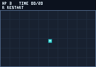
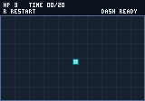
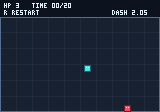
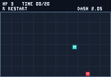
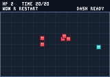

# Arena dash verification — 2026-09-05

The arena dash is implemented and automated acceptance passes. User playtesting
remains the tuning gate; this report does not claim user acceptance. No shared
engine API change was needed.

## Behavior and images

Space / deterministic `dash` starts six fixed ticks at four pixels per active
axis. Direction locks to current movement or the last movement, initially right.
Cooldown is 120 ticks from activation. Holding does not retrigger, and cooldown
presses are not queued. There is no invulnerability. Native and actual WASM
acceptance check this trajectory independently:

| Checkpoint | Player | Dash state |
| --- | --- | --- |
| First dash tick | (84,65) | 5 ticks remaining, cooldown 120 |
| Sixth tick | (104,65) | movement complete, cooldown 115 |
| Hold through tick 121 | (104,65) | ready, no retrigger |
| Release + left at 122, dash at 123 | (99,65) | new dash uses last direction |
| Restart with queued dash | (80,65) | pending input discarded |

Focused Rust tests cover boundaries, diagonal motion, direction locking,
cooldown presses, frozen outcome, reset, and short interactive taps. Native
player tests and the browser DOM lifecycle test cover interruption/cancellation.
The native control test additionally checks dash diagnostic state.

The seed 41700 no-dash route is unchanged: up 30, right 60, repeat down 60/left 120/
up 60/right 120 through tick 1200. It wins at (140,65), health 2, spawned 5. Idle loss
remains tick 310. The RPG reference checksum remains `190a92085def5677`.

Root and the game implementation agent reviewed the initial and winning images
before replacing exact references. Only the new dash HUD changes these no-dash
images: initial `1e5d05f547d53435` → `e096abf94fd12c24`, win
`be61b1c710b101b6` → `b5cf61da6f50efd7`. Regenerated native dash captures have
RGBA checksums `8a4c23c093d41c2e` (tick 1) and `57921739c0129abf` (tick 6).

| Before | Ready | Active | Cooldown | Win |
| --- | --- | --- | --- | --- |
|  |  |  |  |  |

Native GPU readback matches software pixels exactly in both Rgba8Unorm and
Rgba8UnormSrgb for initial, dash-active, dash-cooldown, ready, pursuit and loss
scenes. Browser fixture `/test/` exposes bounded scenarios for visual inspection.

## Playable-host inspection

Computer Use verified the rebuilt native app: R then Space moved the player
right and displayed `DASH 1.2S`; R restored the initial position and `DASH READY`.
Escape closed the owned native player.

The browser GPU fixture passed active (tick 1, x84, remaining5, cooldown120),
completed dash (tick6, x104, cooldown115), and held readiness (tick121, x104,
cooldown0) scenarios. The original no-dash replay won at game tick1200, position
(140,65), health2 and spawned5. Its host frame reached1327 across fixture
restarts, confirming the monotonic clock. Cooldown and winning canvases were
visually inspected; the fixture now scales to narrow browser panels.

The actual browser play page also responded to Space and its pointer Dash
button, showing the shifted player and a 1.9-second cooldown. Restart restored
health3, elapsed0 and dash readiness, with the game paused for user review.
These are agent play checks; user feedback on distance and cooldown is pending.

## Iteration measurements

Single local measurements on macOS 27 arm64, Rust 1.98.1, Node 26.8.1 and Python 3.9.6.
Dependency caches and both debug/release build artifacts were already populated.
The invalidated-source sample touches `games/arena/src/game.rs` to force game
recompilation without a semantic change. It measures a game-only incremental
rebuild, not a clean build, developer authoring time or an improvement against
an earlier engine version. Browser packaging includes target checks, release
WASM compilation and bindgen/package output. Native build includes controlled
and GPU player binaries.

| Stage | Wall time |
| --- | ---: |
| Cached native no-op build | 0.080s |
| Cached browser no-op packaging | 0.596s |
| Invalidated game-source native build | 0.538s |
| Invalidated game-source browser build/package | 1.227s |
| Native launch to discovered registration | 0.287s |
| CLI status, median of 20 | 6.26ms |
| CLI entity inspect, median of 20 | 6.20ms |
| CLI software capture/write, median of 20 | 8.68ms |

CLI timings include fresh process startup, discovery, protocol roundtrip and
JSON parsing. Capture adds software rendering and PPM disk output. They exclude
human image inspection and GPU presentation. Full native acceptance took 7.893s;
that queues over 1,300 individual CLI requests and is deliberately not treated
as an ordinary edit loop.

In this workload, browser rebuild/packaging takes the most time among measured
individual stages; inspection is much smaller. The evidence supports keeping
engine scope unchanged. No clean-build or general performance-gain claim follows
from these warm-cache numbers.

## Gates

Every command below passed. Timings describe this cached verification run, not
benchmark comparisons. Native GPU testing was explicitly enabled in its own
command; it is ignored in ordinary all-target tests. Detailed compact results
are retained in [verification.json](arena-dash/verification.json).

| Command | Seconds |
| --- | ---: |
| `python3 scripts/test-build-tools.py` | 0.060 |
| `node --test web/inspector/bridge.test.mjs` | 0.071 |
| `node --test games/arena/web/inspector/bridge.test.mjs` | 0.072 |
| `cargo fmt --all --check` | 0.126 |
| `cargo test --workspace --all-targets` | 1.029 |
| `cargo clippy --workspace --all-targets --all-features -- -D warnings` | 0.184 |
| `cargo check -p titan -p titan-protocol -p titan-browser --target wasm32-unknown-unknown` | 0.152 |
| `python3 scripts/test-control-loop.py` | 0.648 |
| `python3 scripts/build-browser.py` | 0.598 |
| `node scripts/test-browser.mjs` | 0.076 |
| `python3 scripts/test-starter.py --browser` | 2.241 |
| `cargo fmt --manifest-path games/arena/Cargo.toml --all --check` | 0.181 |
| `cargo test --manifest-path games/arena/Cargo.toml --all-targets` | 1.813 |
| `cargo clippy --manifest-path games/arena/Cargo.toml --all-targets --all-features -- -D warnings` | 0.402 |
| `python3 games/arena/scripts/test-control.py` | 7.893 |
| `cargo check --manifest-path games/arena/Cargo.toml --lib --target wasm32-unknown-unknown` | 0.240 |
| `python3 games/arena/scripts/build-browser.py` | 1.214 |
| `node games/arena/scripts/test-browser.mjs` | 0.081 |
| `cargo test --manifest-path games/arena/Cargo.toml --test gpu -- --ignored` | 0.253 |
| `python3 scripts/test-macos-bundles.py` | 2.142 |
| `node --test games/arena/web/play/*.test.mjs` | 0.088 |

Owned native test/measurement processes terminated normally; discovery entries
were removed. No token-bearing registry files or raw diagnostic bundles are
retained in these committed artifacts.
