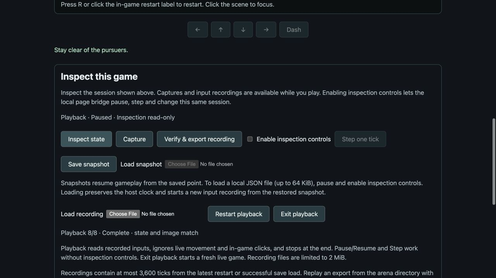

# Interactive arena replay

The arena plays the same bounded input recording in its native window, browser
canvas and headless verifier. Each new recording includes a starting snapshot,
so recording works immediately after restoring a mid-run save.

## Local controls

In the browser Play page, start the player, pause, then choose **Load recording**.
Use Play/Pause, **Step one tick**, **Restart playback**, and **Exit playback**.
The status shows the current recorded tick, total ticks and verification result.
Local playback controls do not require enabling remote inspection controls.
Files remain local; imports are limited to 2 MiB and reject a session change
while the asynchronous file read is in progress.

From the repository root, start a native recording paused:

```sh
cargo run --manifest-path games/arena/Cargo.toml --bin play -- --recording /tmp/arena-recording.json
```

P plays/pauses, N advances one recorded tick while paused, R restarts playback,
and L exits to a fresh live game. The window title shows progress and completion.
Native imports require a regular JSON file no larger than 2 MiB.

Playback ignores physical movement, dash and pointer input. The in-game restart
button is disabled. Exiting playback starts a fresh live game with a new recording;
it does not resume from the last replay frame. Restarting playback restores its
initial snapshot. These transitions clear pending input and wall-clock catch-up
without rewinding the host frame or replacing inspection identity.

## Inspection and verification

Inspection, entity listing, save queries and captures stay available throughout
playback. `arena_state.replay` reports `active`, `position`, `total`, `complete`,
`verified` and `error`. Verification is reported when playback reaches its end;
the player pauses automatically without consuming another simulation tick.

The interactive session exposes commands `load_replay` with
`{"recording": <recording>}`, `restart_replay` and `stop_replay`. Remote commands
require inspection control permission and pause. Existing pause/resume and Step
operate on recorded frames; a Step request exceeding the remaining recording is
rejected before advancing. Ordinary remote `restart` exits to a fresh live game.
Input injection, field edits, save loading and UI pointer commands are rejected
during playback. The isolated Inspector/standalone runner offers headless
verification rather than these interactive playback commands.

Imports are fully validated and replayed in a fresh game before replacing the
current scene. Invalid structure, unsupported identity, inconsistent snapshots,
invalid action edges and final-state/pixel mismatches leave the current session
unchanged. Visible playback independently verifies again at completion.

For headless verification:

```sh
cargo run --manifest-path games/arena/Cargo.toml --bin replay -- /tmp/arena-recording.json
```

Both import paths accept a raw exported recording or the CLI recording-query
response envelope. CLI `--arguments-file` can send a wrapped recording to
`load_replay`; its separate 1 MiB argument-file bound still applies.

## Recording boundary

Format v2 embeds `initial_snapshot` and `final_snapshot` using the arena's
[game-owned save format](arena-save-load.md). It retains the game seed, action
schema, fixed-step duration, source host frame, consumed input frames, summarized
final state and software RGBA checksum. Full final-state comparison includes RNG,
enemy slots, dash/contact cooldowns and other private gameplay state; host time
is deliberately excluded. Input frames preserve active, pressed and released
actions, including held input at a snapshot boundary.

Restart and successful save loading each start a new recording segment. During
playback, querying/exporting the recording returns the original loaded artifact.
Recordings are capped at 3,600 ticks (60 seconds) and 2 MiB on import. Truncated
or externally edited recordings cannot establish exact replay.

Historical format v1 recordings remain supported with their original fresh-game
origin. The checked-in compatibility fixture predates v2; this narrow reader
support does not promise future game/save compatibility. Scrubbing, playback
speed controls, general ECS serialization and rollback remain future work.

## Verification evidence

[Local checks](arena-replay/checks.json) cover 31 Rust tests, strict Clippy,
formatting, WASM compilation, 19 browser input/file tests, actual WASM, native
headless control and the real native GPU player. No rendering algorithm changed;
existing arena reference checksums remain valid. The optional offscreen GPU test
was not rerun; the actual GPU player acceptance passed.

The [mid-dash recording](arena-replay/snapshot-recording.json) starts at gameplay
tick 1 and contains eight subsequent ticks. Headless and visible playback match
its complete final save and pixels. Acceptance also covers contact-cooldown
origins, held edges, malformed-import nonmutation, blocked live/remote input,
monotonic host frames through playback restart and automatic EOF pause.
Historical v1 evidence is tested through both verification and visible-session
playback.

The real browser file chooser loaded that native-generated recording with
inspection read-only. Single-step advanced 0/8 to 1/8; restarting returned to
0/8; Resume completed at 8/8 with a state/image match. Exit restored a paused
fresh live game. The screenshot retains the completed playback controls.



This exercise required no engine API changes. Snapshot origins and playback
policy remain in the arena session; the hosts supply local controls. CI is being
watched by the user, and these new commits have not been pushed.
