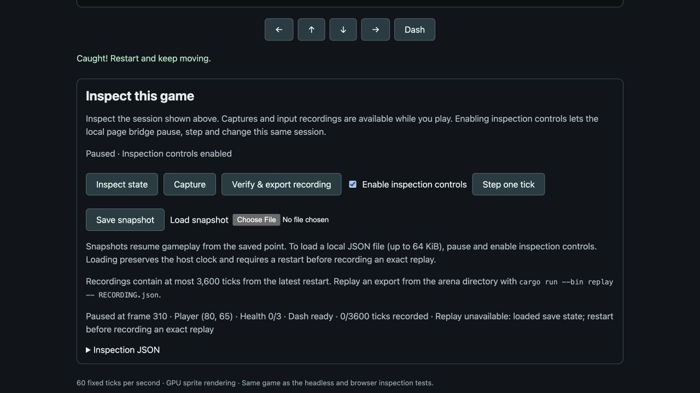

# Arena snapshots

Arena now exercises [the save/load boundary](save-load.md) with a game-owned JSON
format. This work is on `codex/arena-save-load` and has not been pushed. The
published `v0.3.0` source tag precedes this increment.

## Use the browser player

Build the arena browser package and open its Play page. **Save snapshot** exports
the current game state as `arena-save.json`, including while playing with
read-only inspection. To restore it, pause the game, enable inspection controls,
then choose the file using **Load snapshot**. Files stay local to the browser.

Imports are limited to 64 KiB. The page checks the file size before reading and
the UTF-8 size afterward. If the player, reset epoch, pause state or control
permission changes during the asynchronous file read, the import is rejected.
Rust then validates the save before any gameplay changes are installed.

## Use native inspection

From the repository root, build the CLI and start an inspectable player:

```sh
cargo build -p titan-cli
cargo run --manifest-path games/arena/Cargo.toml --bin play -- --inspect --allow-control --project games/arena --instance arena-save
```

In another terminal, export the read-only query and prepare a command argument
file. The CLI response envelope is distinct from the raw save document:

```sh
target/debug/titan --format json --project games/arena --instance arena-save query save > arena-save-response.json
python3 -c 'import json,sys; json.dump({"save":json.load(sys.stdin)["response"]["value"]},sys.stdout)' < arena-save-response.json > arena-load.json
target/debug/titan --format json --project games/arena --instance arena-save invoke pause
target/debug/titan --format json --project games/arena --instance arena-save invoke load_save --arguments-file arena-load.json
```

To load the browser's raw export instead, wrap that file with `{"save": ...}`.
`--arguments-file` avoids embedding the payload in a shell argument; it is shared
by all CLI queries and commands. Its 1 MiB transport bound does not override
the game's 64 KiB limit.

The protocol operations are query `save` with empty arguments and command
`load_save` with `{"save": <snapshot>}`. Live native/browser loading requires both
pause and control permission. The standalone controlled headless server retains
its existing command policy and executes loading at an exclusive safe point.

## State and failure behavior

Format version 1 contains the game seed, player position, all 14 enemy-pool slots,
and the complete `Run`: elapsed ticks, health, outcome, spawn progress, current
RNG state, contact cooldown, dash duration/cooldown, facing and locked direction.
Pool slots express game ordering; runtime entity IDs are not serialized.

Unknown fields, unsupported versions/seeds, missing slots, invalid positions and
inconsistent gameplay counters are rejected. Candidate data and the initialized
target's required components/resources are checked before assignments begin.
This is validation for the current arena rules, not a compatibility promise for
future game revisions. See [an exported example](save-load/browser-save.json).

A successful load reuses the initialized game's entity and asset handles, installs
the gameplay state, recomputes HUD text and refreshes extraction. It clears held
and buffered input, scheduled input and both pointer gesture sources. The live
session resets wall-clock accumulation while preserving its pause state,
monotonic host frame and inspection identity. Successful protocol loading is
accounted for as a state revision; rejected loads leave state and revision alone.

Recording history is retained for diagnosis but explicitly marked invalid for
exact replay: it was recorded from a restart, not from the loaded snapshot.
An actual restart begins a valid new recording. Recording-from-save and general
world serialization remain future work.

## Verification

[Local check results](save-load/checks.json) cover root/arena Rust gates, native
CLI and actual native-window control, actual WASM, browser input/file-read tests
and relocated starter/macOS bundle checks. No rendering algorithm changed;
existing arena and RPG reference checksums remain valid.

Game tests restore both mid-dash and contact-cooldown snapshots, then feed
identical input through later spawns and contact. Complete exports and exact
rendered pixels match. They also cover fresh and terminal states, preservation
of host time/handles/assets, derived HUD updates and rejection without changing
pending input or pointer gestures. Session and WASM tests exercise permission,
pause, stale-input cancellation, recording invalidation and failed-load revisions.

The actual browser file chooser restored an exported lost run after a reset:
HP 0, elapsed 310 ticks, host frame still 310, with the expected replay-invalid
notice. This separately verifies the file workflow; deterministic mid-dash
continuation is covered by the game and actual-WASM tests.



No generic ECS serializer was required. The concrete shared tooling gap was
bounded CLI argument files; the save representation and state-installation policy
remain in the game.
