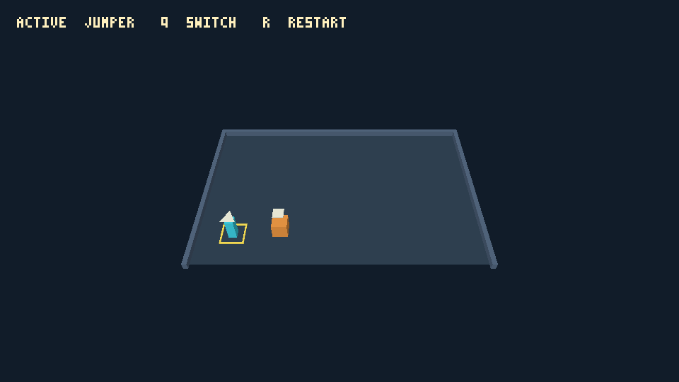

# Initial skeleton observations

These are bounded measurements for [#95](https://github.com/titan-engine/titan/issues/95),
using the [shared procedure](../../agent-iteration.md). Source revision:
`0468ffe00b2cb109acc33591dc382839196ce7fe`, containing adventure foundation
`175e7c6ee9835a20fe934eb11098a05ffcaaa8df` and factory foundation
`65b52f42394888b47f9622efb9aeedc079a7ca09`. The run date is 2026-09-06.
Current gameplay and existing RPG/arena references/README preview were unchanged.

## Reading the numbers

The headless scripts archive the measured HEAD into a disposable directory and
edit only that source. Each uses an initially empty private Cargo target, but
retains installed tools and the global registry/download cache. Other agent CPU
builds were running concurrently. These are single observations, not controlled
comparisons between games or cold-machine measurements.

Timers cover automated commands through assertions, including decoding and
subprocess startup. They exclude task assignment, reading, harness authoring,
reasoning, source extraction and coordination. Full authoring time was **not
measured**. A fast command result is therefore not a claim that an unfamiliar
agent completed the task in that time. The independent measurement agents read
local docs/source; they were not a blinded unfamiliar-agent evaluation. #86/#93
must conduct that separate exercise and record full task time and interventions.

Detailed headless results and reproduction instructions are in the
[adventure report](adventure-notes.md) and [factory report](factory.md). Their scripts preserve the exact scenario,
scratch change, expected assertions and measured phases. To reproduce the historical source, create a disposable checkout at the recorded
revision, then extract the [original harness directory](https://github.com/titan-engine/titan/blob/1b1f138da009e589521df7d3e155e711562a8375/docs/evidence/agent-iteration) from evidence revision
`1b1f138da009e589521df7d3e155e711562a8375` into the same relative location there
(the scripts were not present in the measured commit):

```sh
git worktree add --detach /tmp/titan-skeleton-repro 0468ffe00b2cb109acc33591dc382839196ce7fe
git archive 1b1f138da009e589521df7d3e155e711562a8375 docs/evidence/agent-iteration | tar -x -C /tmp/titan-skeleton-repro
cd /tmp/titan-skeleton-repro
```

Choose an unused disposable path. These completed skeleton experiments are
historical programs, not supported HEAD regression runners.
Run the copied scripts from that checkout and copy results to ignored output in
the maintained checkout under the [evidence lifecycle](../../acceptance-evidence.md); existing `scripts/acceptance_process.py`
is available at the baseline revision. Scripts intentionally measure committed
HEAD and ignore uncommitted source, so later revisions require new evidence and
may require adapting fixture assumptions.
No browser/WASM run was measured here. The existing skeleton verification guides
contain prior browser evidence, which is not counted as a new measurement.

## Native adventure capture supplement

[`native-gpu.json`](native-gpu.json) records a separate successful native
`python3 games/adventure/scripts/test-player.py` invocation: **38.254 seconds**
from invocation to successful exit, including cached builds and waiting for a
concurrent workspace build lock. This is neither cold build time nor isolated
capture latency. GUI reservation and subsequent image inspection were outside
the timer. One attempt, no unexpected failures and no human intervention.

The Metal player presented 242 GPU frames and reproduced the 11-tick fixture:
Jumper `(1500,6500)`, Strong `(3500,6320)`, Jumper selected. Replayed state and
capture matched the controlled route. Paused capture did not advance frame or
revision; restart changed session generation. The second read-only host allowed
capture and rejected control. Both owned players were stopped; GUI focus was
released to the other game tasks. Capture JSON retains identity, semantic state,
and relative image paths. Checksums are within-run GPU consistency evidence,
not a portable exact-GPU reference.



The moved-route image was visually inspected: both marked characters are visible,
the selected outline and active-name HUD are readable, and the practice room is
flat and unobstructed. This establishes capture usefulness for the control
foundation, not puzzle legibility or a player usability study. Initial, replay,
reset, selection and read-only images remain alongside the JSON for comparison.
Factory capture in this baseline is CPU software capture; no factory native GPU
or browser focus was used by the measurement agent.

## Reuse and limits

Use [`template.json`](template.json) for the final exercises, with their own
revision, independent evaluator, task specification, complete task timer,
failures and fixes, source patch/fixtures, diagnostics and captures. Retain
machine-readable phase observations as supplementary evidence rather than
forcing game-specific state into a generic benchmark schema.

The skeleton baseline deliberately cannot verify puzzle solutions, jumping,
fall recovery, plates/doors, factory item transport/production or completion.
The task reports distinguish intentional rejected operations, unsupported
capabilities and accidental harness failures. There is no numerical budget,
performance optimization proposal, new runtime platform, or hot reload change.
