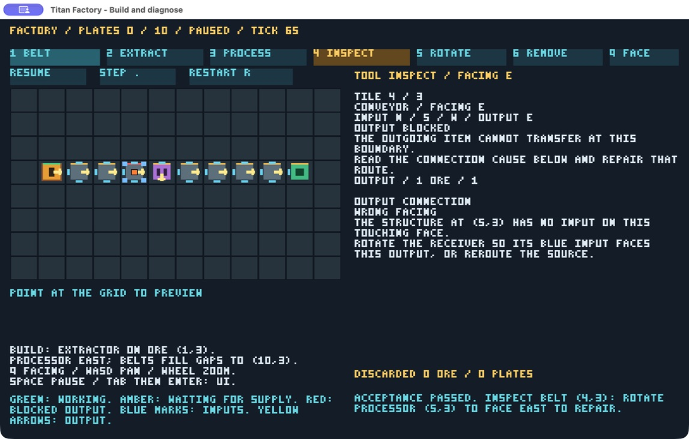

# Independent finished-factory verification

Historical verification for [#93](https://github.com/titan-engine/titan/issues/93),
performed 2026-09-06 against the actual merged final factory revision
`e4800939606889669e8a9b04650cda4bce6df37d` (#92 / PR #113). This revision includes
shared baseline commit `1b1f138da009e589521df7d3e155e711562a8375`. The production
source stayed unchanged during this exercise. The verification author had no
factory implementation history, but read the design, usage and acceptance source;
this is independent engineering playtesting, not a blinded human usability study.
The separate [variation evaluator](variation/README.md) received fresh context,
public docs and a task, without an implementation walkthrough.

The [shared procedure](../../agent-iteration.md) guided workload descriptions,
revision pinning, failures, timing boundaries and cleanup. Historical observations
at `0468ffe00b2cb109acc33591dc382839196ce7fe` describe the construction skeleton;
they are not measurements of this finished game and are not substituted here.

## Acceptance evidence

| Scope | Fresh evidence and outcome |
| --- | --- |
| Construction, rotation, congestion, production, completion | Native and browser routes built through visible controls; deliberately west-facing last belt, observed plate backlog, inspected wrong-facing explanation, repaired to east and reached ten plates. [Player report](player/README.md). |
| Removal and restart | Native occupied extractor preview/removal discards exactly one ore. Independent browser route removes an occupied conveyor and a processor containing queued/in-process ore, checks previews and exact counters, reconstructs, completes and resets. |
| Reproducible fault diagnosis and repair | [Browser DOM exercise](https://github.com/titan-engine/titan/blob/17723e62334a19763f8cf81b2f31cc840b4d6289/docs/evidence/factory-verification/player/browser-exercise.html), seven saved authoritative [checkpoints](player/browser-exercise.json), [native parity verifier](https://github.com/titan-engine/titan/blob/17723e62334a19763f8cf81b2f31cc840b4d6289/docs/evidence/factory-verification/player/verify-traces.py): 3,767 boundaries independently conserved; all seven native/browser semantic states match. Two fresh browser runs match all snapshot fields except host frame. |
| Actual native/browser graphics | Inspected window/canvas screenshots, including [native tick 65](player/native-known-state.png) with [matching state](player/native-known-state.json), and [repaired tick 66](player/native-known-repaired.png) with [exit state](player/native-known-repaired.json). Browser 900px layout and paused camera controls verified. |
| Moderate larger fixture and repeated measurements | [Scaling report](scaling/README.md): bounded fixed-grid workloads, actual slot accounting and deterministic repeats, workload/environment metadata, separate timings and limitations. |
| Unfamiliar author | [Disposable 90-tick processor variation](variation/README.md): first delivery 159, completion 969, 978 conserved boundaries, exact ordered replay, live rejection/recovery and captures. Patch retained; no new gameplay shipped. |



The yellow ore marker on belt (4,3), south-facing processor at (5,3), red blocked
indication and visible wrong-facing remedy agree with the exported tick-65 state.
After three clockwise rotations and one Step click, the belt is empty and the
processor contains in-process ore at remaining=120. The tick-66 image and final
stdout state agree. Screenshots are observational evidence, not new golden hashes.

## Player feedback and diagnostic limits

The palette, fixed deposit, yellow outputs/blue inputs and pinned inventory panel
made the straight challenge buildable without undocumented operations. The panel
correctly distinguished missing supply from a blocked output. Following downstream
full-destination reports to the wrong-facing receiver led to a successful repair.
Item markers and machine work changed consistently with stepping and completion.
The native bitmap font is readable at the observed window size, although its
all-caps, dense explanation text requires more reading than the browser panel.
Browser completion clearly disables step/resume and retains inspection.

The deliberately wrong-type line exposed practical recovery friction: installing
a processor does not convert ore already queued downstream. The first independent
harness expected delivery too soon and failed. Clearing those four downstream
belts plus the processor replacement tile explicitly discarded five ore; production
then recovered. This is correct selected conservation behavior, but the generic
remedy does not spell out the entire cleanup procedure. The retained exercise
makes that recovery reproducible. No silent item loss or simulation defect was
found in these bounded scenarios.

Native restart resumes immediately; browser restart pauses. This is an observed
host behavior difference, not a tick-rate defect. Native construction/removal UI
is drawn into the game window and does not expose individual accessibility
controls to the computer-use accessibility tree. Coordinate interaction and
visible feedback were therefore needed. Native live inspection/discovery is not
provided by this player; the known-state fixture and final stdout give authoritative
state, while the separate CLI host covers live diagnostic tooling. These are
limitations for future planning, not evidence of a live native inspector.

Recipe work duration has several source/UI/metadata assumptions; the isolated
variation found them through search. Its original 120-tick acceptance suite is
not claimed to pass under changed rules. Full receipt-to-result authoring timing
was missed, and is explicitly unavailable; phase and partial wall intervals are
reported instead. No end-to-end authoring latency comparison is supported.

The planning input for [#94](https://github.com/titan-engine/titan/issues/94) is to
consider recovery wording for already queued wrong items, consistent restart
expectations, accessible native controls/live observation, and consolidation of
recipe configuration if more recipes are selected. None is an approved new game
system or an optimization mandate. The larger-fixture observations do not establish
capacity beyond the fixed 96-cell world or a portable frame-rate guarantee.

## Reproduce and interpret

The player report records historical GUI steps and links the original browser
harness at its immutable evidence revision. Reproduce those observations in a
disposable checkout of the measured source SHA; historical harnesses may write
beside themselves. Keep new outputs in ignored storage.

The maintained native repair regression can run against HEAD:

```sh
CARGO_BUILD_JOBS=4 cargo build --manifest-path games/factory/Cargo.toml --bin titan-factory
python3 games/factory/scripts/verify-traces.py --output-dir target/evidence/factory-repair
```

It checks all 3,767 native operation boundaries for rejection and independently
counts slots, then compares seven read-only historical browser semantic checkpoints.
Its JSON summary identifies both the current native revision and the recorded
browser source. The output directory contains only generated summary and sequence;
fixtures are never overwritten. This checks native behavior against a recorded
browser baseline, not current browser rendering or live native/browser parity.
Host/UI exclusions are explicit in the summary and fixture provenance. See the
[game guide](../../../games/factory/README.md#source-and-checks) for current checks.

Follow the scaling and variation reports for their separate reproducible commands.
All tasks used macOS 27.0 arm64 on Apple M5 Pro (18 logical CPUs), Rust/Cargo 1.98.1,
Python 3.9.6 and Node 26.8.1; native gameplay used Cargo dev and Metal, browser
packages used release WASM with the in-app Chromium browser's available GPU backend.
No explicit browser backend override was selected or cross-backend claim made.
Build/cache/concurrent-work details belong to each measurement. Other agents and
builds were active; GUI focus was reserved separately with the adventure coordinator.

Owned GUI players and localhost server were stopped; temporary browser tabs closed,
viewport override reset, and the web-root copy of the evidence harness removed.
Variation/scaling scratch cleanup is recorded by their reports. No registry tokens,
private session links, releases, tags, RPG/arena references or README preview changes
are part of this evidence.

[Local validation](validation.json) passed workspace formatting/tests/Clippy/WASM,
factory formatting/tests/Clippy, native control, compiled-WASM parity and DOM unit
checks. Both explicit native GPU render tests passed, including software/GPU
agreement after camera changes and transport positions. PR checks and independent
review evidence are recorded on the linked PR; final merge and exact merged-main
verification belong to the coordinator.
