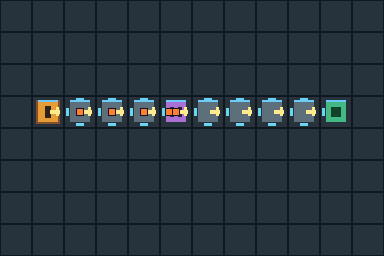

# Unfamiliar-author processor variation

Issue [#93](https://github.com/titan-engine/titan/issues/93), 2026-09-06.
Evaluator: factory variation agent; actual model identity unavailable. The agent
received the bounded 120 → 90 processor-work task and public documentation paths,
without an implementation walkthrough or prior factory implementation work.
It discovered production, interface and inspection code through the README and
source search, and read the shared skeleton baseline before authoring its harness.

Base engine/game revision: `e4800939606889669e8a9b04650cda4bce6df37d`.
Disposable variation commit: `03795c73f208ff021ff067cbad025f13c2b2af1e`.
The first two measurements ran that same patch uncommitted on the base; the
final measurement ran the committed variation. No gameplay change is proposed
for shipping. The five-line [patch](processor-90.patch) changes processor work,
inspection bounds, explanation strings and displayed recipe progress together.

Before editing, the evaluator expected ten deliveries, conservation, deterministic
replay and matching captures. Source/document discovery refined the predicted
trace to processing start at 64, first plate at 154, first delivery at 159,
90-tick subsequent deliveries, and completion at 969. These predictions passed.

## Results and reproducibility

[The script](https://github.com/titan-engine/titan/blob/17723e62334a19763f8cf81b2f31cc840b4d6289/docs/evidence/factory-verification/variation/reproduce.py) drives only public CLI and sequence operations.
[The exact route](route.json) places nine structures, then advances one tick per
operation through tick 969. It asserts successful outcomes, independently counts
resident slots and checks extracted + seeded = resident + delivered + discarded
at all 978 boundaries. It checks delivery count against the predicted formula at
every boundary, and preserves full representative states in
[measurement.json](measurement.json). A second fresh sequence process repeats the
same ordered operations and compares all outcomes and complete state exactly.
A separate controlled host reaches the identical full final state with a single
969-tick advance, then restarts and repeats the route.

The live host discovers capabilities, commands, queries and entities. Removing
fixed delivery intentionally returns `invalid_value` / `FIXED_DELIVERY` and leaves
state unchanged. Its diagnostic manifest was parsed and the API inventory and PNG
were verified present. Recovery places and removes a temporary conveyor, restoring
the initial state. The published diagnostic summary retains the error and artifact
existence, not private bundle paths or registry credentials. Bundle payloads were
not audited in full for semantic diagnostic completeness.

Post-completion advancement preserves every game-state field; the host `frame`
continues advancing. Restart preserves that clock too, so replay comparisons after
restart exclude only `frame`. Headless capture identity also retains session
generation zero across the game-level restart: this experiment reports observed
identity, not a host-session-reset guarantee. [Capture identities](measurement.json)
retain both accepted host frames/revisions. Captures are byte-identical, checksum
`abb5b3a5602e3d48`; [raw PPM](complete.ppm) has SHA-256
`2e3d058ff3a1db6e8b731cf856639b38468a6b3323a1b60d0b4c3ac9e666c950`.



The converted PNG was visually inspected: the straight route, extractor,
processor, item markers and delivery are visible. This software image has no
player HUD and cannot establish native/browser interface usability. The PPM is
the original capture; the PNG is a lossless format conversion using macOS `sips`.
No GUI was opened or focused. Owned hosts exited and discovery cleanup passed.

This completed variation is historical; the runner is retained at
[evidence revision `17723e62334a19763f8cf81b2f31cc840b4d6289`](https://github.com/titan-engine/titan/blob/17723e62334a19763f8cf81b2f31cc840b4d6289/docs/evidence/factory-verification/variation).
To reproduce from the repository root, use unused disposable paths:

```sh
mkdir /tmp/factory-variation-evidence
git archive 17723e62334a19763f8cf81b2f31cc840b4d6289 docs/evidence/factory-verification/variation | tar -x -C /tmp/factory-variation-evidence
evidence=/tmp/factory-variation-evidence/docs/evidence/factory-verification/variation
git worktree add /tmp/factory-variation-repro -b codex/factory-variation-repro e4800939606889669e8a9b04650cda4bce6df37d
git -C /tmp/factory-variation-repro apply "$evidence/processor-90.patch"
python3 "$evidence/reproduce.py" /tmp/factory-variation-repro /tmp/factory-variation-results
sips -s format png /tmp/factory-variation-results/complete.ppm --out /tmp/factory-variation-results/complete.png
```

The script uses the existing acceptance process helper for separate bounded build
and runtime commands and owned-process cleanup. Choose unused scratch/output
paths; a rerun overwrites measurement files in the selected output directory.
The script currently records macOS CPU information with `sysctl`.

## Time, attempts and friction

A full receipt-to-result monotonic timer was **not captured**. The agent initialized
a wall timestamp after its first documentation-read tool: 10:17:20.783 UTC.
Therefore no full authoring-latency or baseline speedup claim is supported.
The partial interval and final verification timestamp are recorded in
[authoring.json](authoring.json); it includes subsequent reading, source discovery,
editing, build waits, harness correction, evidence writing and visual inspection.
The command phases use monotonic `perf_counter` within each harness process.
No GUI coordination wait occurred. Three harness runs are retained, not treated
as a statistical sample: one failed, one corrected, one added exact ordered replay.

[Attempt 1](attempt-1.json) built with an empty private Cargo target in 20.831828 s,
verified the trace in 2.861708 s, then failed a live harness assertion after 1.684071 s.
The incorrect assertion compared host `frame` after post-completion advancement.
This was an evaluator error, not a discovered simulation defect: the README
already distinguishes preserved host clock from game tick. The report explains
the originally empty Python AssertionError text. [Attempt 2](attempt-2.json) passed
with a 0.160344 s warm build, 2.511938 s trace and 1.902282 s live exercise. Final
phase timings, including the additional same-order fresh replay, are in the final
measurement. Phase totals include subprocess and JSON/assertion overhead; they
are not renderer or simulation microbenchmarks.

The machine was macOS 27.0 arm64, Apple M5 Pro, 18 logical CPUs, Rust/Cargo 1.98.1,
Python 3.9.6 and Node 26.8.1. The backend was native CPU/software, Cargo dev profile
with debug information. Only the first build target was cold; global registry and
toolchain caches were retained. Other agents ran a native factory player and a
scaling probe on the same host; CPU/filesystem scheduling was not isolated.
No Cargo output directory was shared and no RUSTC_WRAPPER was set.

The source map and CLI examples were enough for the bounded variation. The main
extensibility friction is that recipe duration appears in simulation, metadata,
UI arithmetic/text and original acceptance expectations rather than one recipe
configuration. Search found those copies before editing. The variation deliberately
does not rewrite original 120-tick unit/native/browser fixtures; therefore the
original all-target test suite is not claimed green for this experiment. The
purpose-built trace checks the changed contract. No new recipe type, public engine
API, browser/WASM build, native GPU verification, scaling measurement, crate
publication or performance threshold is claimed here.
