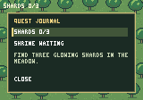

# RPG quest journal

The RPG's existing quest HUD now opens an in-game journal. Press **J** or click
that label; use **Up/Down**, **Tab/Shift-Tab**, or the pointer to select the shard
or shrine objective. **Enter/Space** activates the focused row or Close button;
**Escape** closes the journal. Native Escape retains its exit behavior when the
journal is closed. The browser canvas must have keyboard focus.

The journal starts closed, preserving the accepted world and HUD pixels. Its
content derives from `QuestState`; it adds no inventory, quest rewards or other
gameplay state. Labels/buttons are named `ui/journal/...` ECS entities. The game
owns objective content and the generated panel/highlight images. Shared UI owns
explicit column placement, bounded bitmap text and scoped focus. See the
[UI API guide](ui.md) for contracts and limitations.

## Session and inspection policy

Opening suspends fixed ticks and clears buffered, held and scheduled movement.
Closing restores the pause state that preceded opening. An explicit pause/resume
request while open changes that restored policy while the panel remains modal;
completed playback always stays paused. Native and browser hosts consume game
keys while the panel is open. Focus loss and resize cancel gestures/focus and
movement; a new key press or pointer gesture is required afterward. Repeated
pause/resume requests also cancel held sources. Native Escape auto-repeat cannot
exit the player immediately after closing the panel.

The existing authenticated/opt-in inspection boundary applies to journal commands:

- `journal_key` takes `key`: `toggle`, `next`, `previous`, `activate`, or `close`.
- `journal_pointer` takes logical framebuffer `x`, `y` and `pressed`. Omit both
  coordinates to supply an outside sample. Physical and controlled pointers have
  independent gesture state and cannot complete each other's clicks.
- `query rpg_state` includes `journal.open`, `journal.selected` and the focused
  entity name. Entity inspection exposes text, wrapping, visibility and resolved
  rectangles through read-only UI fields.

Step, input injection and field mutation are rejected while the journal is open.
Load/restart reconstruct closed UI with default selection and cleared focus;
transient presentation is not serialized into gameplay snapshots. Host frames
and inspection identity stay monotonic. Invalid imports leave the current panel
and game intact.

## Replay and images

`render_image` captures the actual visible panel. `render_replay_image` uses the
same game extractor with journal entities/background excluded, retaining the
normal quest HUD. Recording export and verification use this canonical view, so
an unrecorded focus selection cannot invalidate gameplay replay. Opening a
journal during playback suspends it; closing restores prior playback pause state.
The portable action schema, snapshots and recording versions are unchanged.

The eleven-tick reference still collects all three shards and activates the
shrine with checksum `f7a298f62ad75c1c`. Arena references remain
`e096abf94fd12c24` and `b5cf61da6f50efd7`. The README's committed 1280×896 preview
is unchanged. A new initial open-journal software capture has checksum
`189f600ebd82feea`:

## Verification

The native/WASM replay acceptance scripts exercise journal navigation, policy,
pause restoration, reset and canonical replay pixels. See the
[verification guide](verification.md) for current commands.
The [original acceptance report](https://github.com/titan-engine/titan/blob/e4ff0dff2d02dfffa6bc085286798886a92e30e7/docs/journal.md#verification)
records its native/browser GUI observations and source evidence; the illustration
above is retained from that run, not a fresh verification claim.
