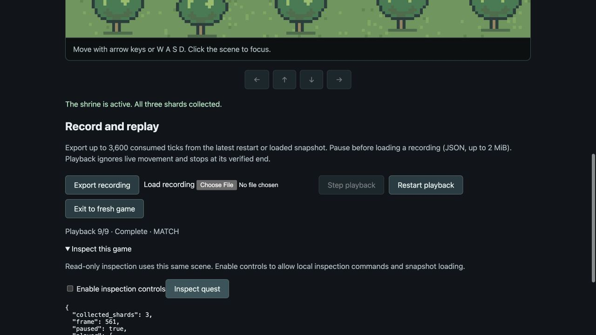

# RPG snapshots and interactive replay

File-backed hosts retain the startup player/tree image pair through playback and resets.
Fresh native verification accepts `--assets-dir DIR` and must use the same images;
different art fails final pixel verification. Recordings do not embed PNG bytes.
See [asset loading](assets.md) for default paths and the procedural comparison.

The RPG and arena both use [Titan's shared replay primitives](replay.md).
The RPG keeps its own snapshot schema and validation for player/shrine position,
remaining collectible shards, quest progress and shrine activation.

## Try the retained recording

From the repository root:

```sh
cargo run --example play_rpg -- --recording docs/replay/rpg-recording.json
```

The player starts paused partway through the quest, after the first shard was
collected. P plays/pauses, N steps one recorded tick, R restarts playback, and L
exits to a fresh live game. This short recording contains nine ticks, so stepping
is useful for watching the remaining pickups. At completion the window title
reports verification and the game pauses automatically.

To verify without a window or GPU:

```sh
cargo run --example replay_rpg -- docs/replay/rpg-recording.json
```

The result includes the complete canonical save and exact software image
checksum. Both paths accept raw recordings or CLI recording-query envelopes,
limited to 2 MiB. `play_rpg --replay` remains a convenience for displaying the
completed built-in reference route; `--recording` plays an imported file.

## Browser player

```sh
python3 scripts/build-browser.py
python3 -m http.server 8000 --bind 127.0.0.1 --directory web
```

Open [Play](http://127.0.0.1:8000/play/), start and pause the game, then choose
**Load recording**. Resume, single-step, restart playback and exit operate on the
same canvas. These local playback controls do not require inspection opt-in.
Live movement is ignored during playback. Export your own consumed-input
recording after playing; its initial snapshot makes a mid-quest origin portable.

## Native inspection

For inspection of the actual GPU player:

```sh
cargo run --example play_rpg -- --inspect --allow-control --instance rpg-live
```

The headless controlled host remains available with
`cargo run --example procedural_rpg -- --serve --instance rpg-live`.
It advances only through Step requests. Query `save`, `recording` or `rpg_state`;
pause before invoking `load_save` with `{"save": <snapshot>}` or `load_replay`
with `{"recording": <recording>}`. The CLI's `--arguments-file` bound is 1 MiB,
separate from the game's save and recording limits. Native field edits still
require the host's existing mutation permission.

During playback, inspection and captures remain available. Step consumes recorded
frames; requests exceeding the remaining budget are rejected. `restart_replay`
restores the origin; `stop_replay` or ordinary `restart` starts a fresh live game.
Input injection, field edits and `spawn_shard` cannot change playback. The isolated
browser Inspector exposes read queries but does not advertise session playback
commands.

## Snapshot behavior

Save format v1 is game-owned and bounded to 64 KiB and 256 remaining shards.
Shard records retain names and positions, including duplicate and development-
spawned shards. Canonical ordering permits state comparison independently of
entity allocation history. Player, shrine and UI assets stay in the initialized
world; loading recreates remaining collectibles, restores/removes shrine
activation and rebuilds quest text. It preserves the host frame and clears
pending input and movement repeat state.

Validation covers version/seed, coordinates, bounded names/counts and quest
consistency, plus the initialized target's required topology before changing it.
Unsupported inputs leave state unchanged. There is no future save-compatibility
promise. Successful loading starts a fresh recording segment; development field
or spawn edits invalidate the existing segment until restart or a successful load.

## Acceptance

The scenario starts with three shards, moves right twice to collect the first,
then saves. After completing the quest, it loads that earlier snapshot and checks
that two shards reappear, the shrine becomes inactive and the HUD reads
`SHARDS 1/3`. Playing down three and right six collects the remaining shards and
reaches the reference shrine state. Full snapshot and pixels match in native
headless, native GPU and actual WASM playback; checksum remains
`f7a298f62ad75c1c`.

The checks also reject malformed/cross-game recordings without mutation, preserve
host frames through restart, block interfering input, and pause at EOF. Run:

```sh
python3 scripts/test-rpg-replay.py
python3 scripts/test-rpg-replay.py --gpu
node scripts/test-rpg-replay.mjs
```

[Local check results](replay/local-checks.json) include workspace/arena gates,
external starter/browser and macOS bundle regressions. The real browser file
chooser loaded the retained native recording with inspection read-only, stepped
and restarted it, then completed at 9/9 with a match. Exiting preserved host time,
returned to a fresh quest and cleared stale inspection output.



[Completed quest canvas](replay/rpg-browser-canvas.png) and
[arena playback after migration](replay/arena-browser-controls.png) retain the
visible integration evidence. Rendering algorithms and reference images were
unchanged; native GPU players were exercised instead of rerunning the optional
offscreen GPU suite.
