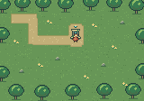
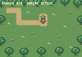

# Entity-based game UI

Titan's first UI slice uses ordinary ECS entities for fixed-pixel labels and
primary-pointer buttons. Arena uses it for health/time, restart/outcome and dash
status; the RPG uses it for quest progress. Browser host controls and diagnostic
panels remain HTML tooling around the game.

## Authoring and rendering

Create `BitmapFont::tiny(&mut assets)` once alongside the game's `ImageAssets`
and insert both as resources. Spawn a named entity with `UiNode` and `UiText`:

```rust,ignore
world.spawn_with((
    Name::new("ui/quest"),
    UiNode::new(4, 4, 152, 5),
    UiText::new("SHARDS 0/3").with_color(Color::rgb(255, 248, 217)),
));
```

Game systems update text from gameplay state before extraction. Call
`titan::ui::append_ui(world, &mut frame)` from the game's extractor. It emits the
same renderer-neutral glyph sprites for software, native GPU and browser GPU
rendering. UI text and positions are component data, rather than strings
constructed only inside a render function.

`UiNode` describes logical framebuffer coordinates, hit bounds, visibility, layer
and order. New nodes use layer 100. By default bounds do not clip or wrap text.
`UiText` contains text, tint and opt-in wrapping. The built-in 3×5 font supports uppercase letters, digits,
period and slash; unknown glyphs advance without drawing. `BitmapFont::new`
accepts a game-owned glyph map and spacing.

The API has one font resource per world. `UiColumn::new(x, y, width, gap)` emits
successive `next_node(height)` rectangles for explicit column layout. It is a
small placement helper; the game retains the resolved `UiNode` components.
`UiText::with_wrap()` opts into word wrapping and truncation to whole font cells
inside the node. `BitmapFont::measure_wrapped(text, width, height)` reports width,
height, line count and truncation using the same layout. Long words split across
cells; explicit newlines work. Legacy text remains unbounded and unchanged.
Custom glyphs should fit their spacing cells; there is no per-pixel text clip,
shaping, font fallback, automatic parent layout or scrolling.

`UiFocus` takes an explicit ordered slice of button entity IDs owned by the game.
`navigate(world, scope, backwards)` skips missing, hidden and disabled buttons;
`set` selects a valid pointer target and `activate` revalidates before returning
an entity. Games translate host key edges into navigation/actions and render
focus. Focus owns no physical key state or implicit global focus tree. The RPG
[journal](journal.md) demonstrates these APIs and modal input routing.

## Interaction and inspection

Add `UiButton` to make a node a pointer target. A game owns `UiPointer` gesture
state and interprets the activated entity through its own marker or action.
Activation requires pressing and releasing inside the same enabled button;
outside releases cancel. Visible disabled buttons consume input without acting.
Once a pointer update observes its target hidden, disabled or removed, restoring
the target cannot revive that gesture. Physical and inspector gestures in the
arena have separate capture state and cannot combine into one activation.
The topmost button wins by layer, order and entity identity. Hosts should offer
the pointer to UI before any world pointer action and honor `consumed`.

Native hosts map physical window coordinates; browsers map CSS coordinates.
`point_from_surface` maps a stretched surface to logical framebuffer coordinates
and rejects outside, nonfinite and zero-sized inputs. Hosts own physical pointer
IDs and cancellation. Cancel gestures on focus loss, resize, pause and restart;
discard orphaned events from the canceled gesture.

Call `register_ui_inspection` once for each game inspector. Names, text, color,
bounds, order, visibility and button enablement are available through the existing
entity protocol. Fields are read-only in this slice; game systems own their values.
Game-defined commands provide interaction at exclusive runtime safe points.

Arena names its UI entities `ui/status`, `ui/restart` and `ui/dash`; RPG uses
`ui/quest` plus `ui/journal/...`. Arena's `ui_pointer` command feeds logical pointer samples through the
same hit test as physical input. Consult its command metadata for arguments.
Live native/browser inspection requires control opt-in for commands; a headless
controlled server retains its existing command policy. UI inspection is read-only
without requiring control permission.

Restart preserves the monotonic host frame, resets gameplay and pending input,
and starts a fresh consumed-input recording. The recording describes gameplay
since that restart; it does not archive the preceding pointer gesture. The
[save/load boundary](save-load.md) explains why UI entities and gestures are
reconstructed state rather than automatically serialized gameplay.

## Visual reference

The RPG adds a quest label while preserving the world and reference walk. The
completed replay still collects three shards in eleven ticks and activates the
shrine. Its new software checksum is `f7a298f62ad75c1c`; the prior world-only
capture was `190a92085def5677`. All 206 changed pixels are inside the label's
rectangle at `(4, 4)` with size `152 × 5`; world pixels outside it are identical.

| Before | Entity-based quest display |
| --- | --- |
|  |  |

For current checks, use the [verification guide](verification.md). The
[historical UI acceptance report](https://github.com/titan-engine/titan/blob/e4ff0dff2d02dfffa6bc085286798886a92e30e7/docs/ui.md#verification)
records the original native/browser exercise; those observations do not verify
later revisions. The [quest journal](journal.md) demonstrates explicit column
placement, bounded bitmap text and scoped keyboard focus.
