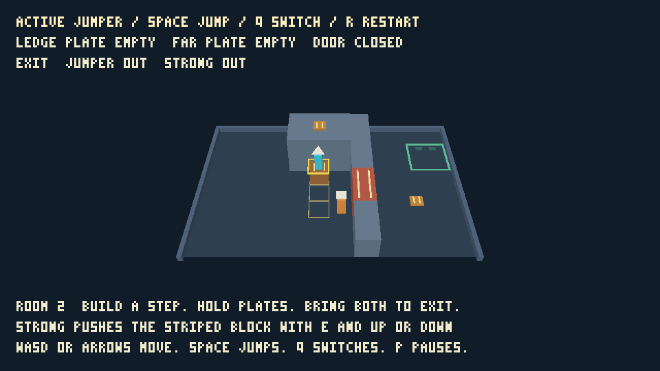
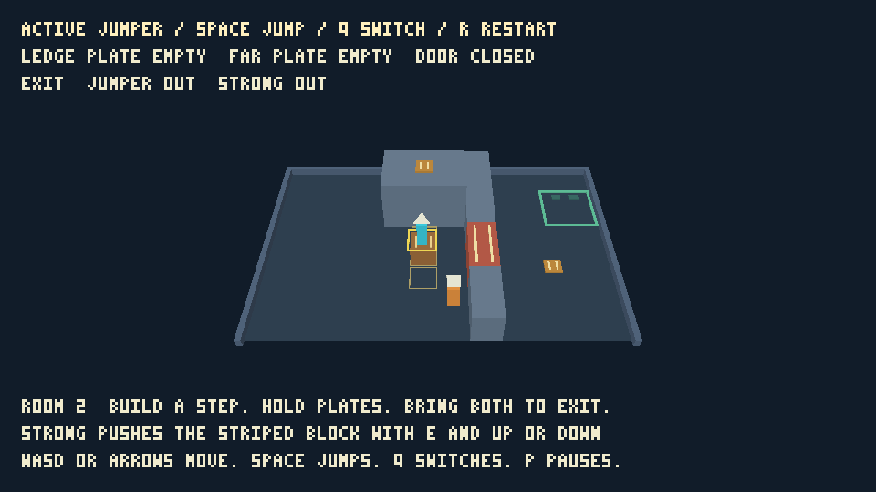

# Independent adventure evaluation (#86)

Gameplay revision: `02272893a0d91af2b1ac6b5159644b70ab46108c` (PR #121).
This directory adds new evaluation evidence on 2026-09-06; it does not reuse
#95's historical exercise. Production gameplay was unchanged during evaluation.
The PR head identifies the evaluation scripts and documentation; the SHA above
identifies the engine/game producing the native and browser captures.

## Presentation and controls

The evaluator ran `python3 games/adventure/scripts/test-player.py` on macOS,
Apple M5 Pro, native Metal. It passed with 4,311 presented GPU frames, exact
route replay, surface lifecycle checks and read-only capture. Selected original
PNG readbacks and their full state/identity are in [native.json](native.json).
No capture advances the accepted frame or revision; resets change generation.

After `python3 games/adventure/scripts/build-browser.py`, serve the package:

```sh
python3 -m http.server 8768 --bind 127.0.0.1 --directory games/adventure/web
```

Open `/play/test.html?backend=webgpu` and `/play/test.html?backend=webgl2`
separately in an actual browser. Codex's Chromium in-app browser passed **209
checks per backend**, exercising ordinary keyboard routes, both block sockets,
full-sequence replay, held aliases, pause/resume, restart, capture cancellation,
and surfaces at 640×360, 800×500, 960×540 and 1280×720 plus capped high DPI.
[WebGPU](webgpu.json) and [WebGL2](webgl2.json) retain every check and capture
state/identity; only selected images are retained. Missing `artifact` means
that image was deliberately omitted, not that the capture failed.




Direct UI interaction additionally loaded `/play/?backend=webgpu`, pressed
Enter, Q, P and R, and checked the visible scene and inspector: Strong became
active, pause froze play, and R restored Jumper at session tick zero. Native
interaction used the unsigned bundle built with:

```sh
python3 games/adventure/scripts/build-macos-app.py --name 'Titan Adventure 86' --bundle-id dev.titan.adventure86
```

The native Start screen and gameplay window were inspected, then P/Enter,
Q/P and R verified the same visible control changes. The app initially paused
on focus loss; explicit P resumed it as documented. The native acceptance
captures, browser block-support captures and completion screens were also
visually inspected. At 960×540 capture size the controls fit, triangle/square
markers and active outline distinguish partners, stripes link devices, and
both characters remain visible. The fixed view makes the jump gap and push
stance require judgement; semantic support/position data is more precise than
judging a foot position from this oblique view.

The default narrow in-app browser viewport made text small. At a 1280×900
browser viewport the 1100×619 canvas and prompts were readable. The page already
recommends 960×540 or larger. This is desktop prototype evidence, not a mobile
usability claim. Direct UI checks were short control checks; complete solutions
were bounded automated input/replay, not an uninterrupted human playthrough.

## Independent semantic and authoring exercises

The [new semantic runner](../../scripts/test-playtest.py) completed three
scenarios with 34 checkpoint recording replays. It perturbs both full sequence
routes with excursions and waits, deliberately abandons and recovers B, tests
held transitions and airborne switching, reverses the intermediate block, and
restarts with future input queued. See [method](semantic-method.md) and
[retained states/operations](semantic.json). This preserves reproducible input
and assertions without claiming the navigation templates were newly discovered.

The [unfamiliar agent's exercise](variation-notes.md) moved room 1 plate B south
600 mm in a disposable copy, adapted a 579-tick ordinary-input solution, checked
room 2 stayed unchanged, diagnosed a deliberately invalid recording and verified
semantic replay and host cleanup. The [baseline](variation-baseline.json) records
its own commands, phases, failed attempts, missing documentation and zero human
interventions. The agent missed a monotonic timer at handoff: full-task time is
therefore **unmeasured**, while the observed UTC interval was 244 seconds and
first successful command phases totalled 15.044 seconds. Those phases do not
establish full authoring latency. The dedicated target may have been warmed by
a failed detached launch; no cold-cache performance claim is made.

Source search was needed to locate the public plate geometry declarations. The
game README now links those declarations and the concrete variation recipe.
This documentation fix followed the exercise, so it was not help supplied to
the unfamiliar agent. Neither evaluator found a production gameplay defect.

## Mechanics and diagnostic observations

The release/repress rule after switching is predictable in exact-input checks,
but introduces an extra gesture when continuing in the same direction. Fresh
unrelated directions work immediately. The HUD identifies the active partner;
the guide explains the held-input rule. No tuning change is justified by a
single agent evaluation. The two-push launch offers a closer block-to-ledge
position; the shorter one-push route also remains valid.

The final socket cannot be reversed from its required floor stance because
that stance lies inside the ledge. This is a recoverable arrangement: it still
permits completion and R restores the room. Walking off a ledge and failed jumps
land safely without erasing progress. Leaving B too early can strand the other
partner temporarily; returning Strong to B restores passage. These cases must
not be described as irreversible softlocks.

CPU hosts deliberately expose no 3D capture or teleport. Below-floor recovery
therefore uses the existing `movement-acceptance` controlled fixture, not an
invented player command. Fresh native/actual-WASM runs passed 34 movement/1,363
states, 24 puzzle/1,646 states, 27 block/2,650 states, and 6 sequence/11,487
states. These include both characters' defensive fall reconstruction, failed
height gates and initial-socket exclusion, occupancy/rejection rules and room
transition provenance. Exact agreement is semantic evidence, not usability.

The native and browser harnesses duplicate some route/setup/assertion logic
because they control different host boundaries. Shared JSON routes avoid
independent solution definitions. No new framework or mechanics were introduced
to remove that duplication in this verification slice.

## Reproduce local gates

Run the adventure README's verification commands. This evaluation additionally
runs the independent semantic and variation exercises linked below. Package
formatting, all-feature Rust tests and strict Clippy, native control, actual
WASM CPU conformance and keyboard tests were rerun. Workspace formatting,
tests, strict Clippy and WASM core checks are recorded in `gates.json`.
Existing RPG/arena checksums and the README preview are unchanged.

Native acceptance hosts shut down through their owned-process cleanup. The
manual native app and local HTTP server were stopped, the temporary browser tab
closed, and its viewport override reset. Capture downloads were sanitized into
this directory; discovery credentials are not evidence.

Limits: one machine and one unfamiliar-agent sample; no broad accessibility,
human learning-time, long-session comfort, cross-platform GPU equivalence or
exhaustive proof against every possible softlock. GPU checksums are backend-local
consistency checks. No mechanics or new future issue was added under #86.
