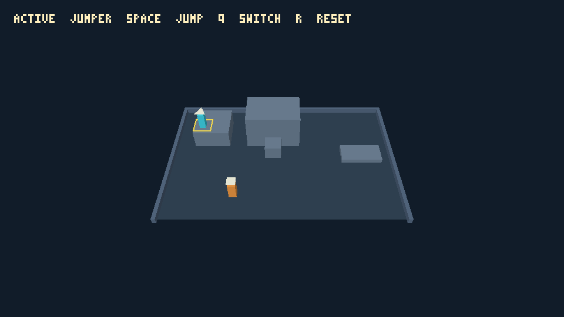
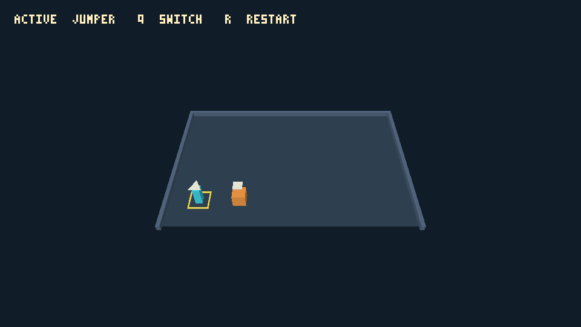

# Jumping and collision verification

Issue #82 was exercised on 2026-09-06 on macOS / Apple M5 Pro. The practice
room combines movement fixtures; it does not implement puzzle progression.
The design's movement, gravity, body/support rules and jump values are retained.
Jumper clears the 1 m teaching ledge and Strong does not. The fixed 0.75 m step
and 2 m ledge exercise the later block-assisted jump without adding block moves.

The native Metal player presented 609 GPU frames in the movement acceptance
run, including captures at Jumper's 1530 mm apex, grounded at Y=1000, Strong's
450 mm apex and blocked at the ledge face Z=3200. Inspection confirmed
support height agrees with the mesh, the active outline follows the foot height,
and both characters remain visible. Initial, repeated, reset and read-only
captures agree (`8a01b23469b2d61d` on this backend). Existing RPG/arena references
and the committed repository README preview are unchanged.

The actual browser GPU acceptance page independently passed WebGPU and WebGL2.
It exercises both apices, a teaching-ledge landing, safe walk-off, Strong's
blocked attempt, held-Space behavior, keyboard switching/release gates, replay,
reset/capture invalidation, and 960 × 540 / 1280 × 720 presentation. Browser
landing captures were visually inspected alongside the native result. These are
actual GPU/WASM checks; Node results alone do not establish browser rendering.

The optional `movement-acceptance` runner constructs isolated controlled
fixtures for positive footprint support versus edge-only contact, highest
crossed landing and nearest ceiling, high-speed obstacle sweeps, X-then-Z slide,
no step-up/coyote/buffer, both character height gates, each static block socket,
character noncollision/non-support, midair switching, and defensive below-floor
recovery of either character. `node scripts/test-movement.mjs` builds and runs
the same runner natively and in actual WASM: 29 scenarios and 1,309 complete
per-tick states matched exactly.
These fixture helpers are absent from ordinary builds and introduce no player
teleport command. Both intermediate/final socket launches are accepted; the
initial socket remains too far from the high ledge even with generous edge
support. No ability-value tuning was needed.

Package formatting, tests, Clippy, native CLI, actual-WASM control and browser
key checks complement the visual checks. Workspace format/tests/Clippy/core WASM
checks and existing native/WASM RPG control, replay and asset loops also passed.
Run commands are in the [game guide](README.md). The movement conformance runner
is included in required CI, alongside the existing native player check.

Limits: this is a bounded automated prototype check, not extended human playtest
feedback. Release/repress switching remains the initial documented policy.
Jumper's narrow body is 350 mm wide inside its 400 mm collider; Strong's body
fills the shared 400 mm footprint. Both bodies are 900 mm high. Exterior walls
retain the documented cutaway treatment; foreground collision has no wall mesh.
No general physics, block pushing, plates, doors, or puzzle sequence is claimed.
GPU checksums express same-backend consistency, not a portable pixel promise.

# Control foundation verification

The control foundation was exercised on 2026-09-06 on macOS / Apple M5 Pro.
The historical section below records issue #81 before jumping was added.

The capture shows the fixed elevated camera, narrow cyan Jumper with triangle,
broad orange Strong with square, active ground outline and active-name HUD.
No foreground wall hides the starts. This is an actual native Metal capture,
not a software reference or an image generated separately from the game.

## Reproducible checks

- Package Rust tests cover axial/diagonal/opposing movement, bounds, inactive
  stationarity, input switching and repeat edges, restart precedence, recording
  limits and transactional rejection, physical aliases and focus/resume handling.
  Inspector stepping across a recorded restart retains playback; mixed step
  chunks, local stepping and timed playback agree. Explicit restart still exits
  replay, and both reset paths invalidate old capture identities.
- `scripts/test-control.py` drives the authenticated native server through the
  Titan CLI. `scripts/test-browser.mjs` runs a fresh native trace and compares
  every complete state against actual WASM executing the same 11-tick fixture.
  The final positions are Jumper `(1500,6500)`, Strong `(3500,6320)`, with Jumper
  active. Recording playback produces the same consumed input and positions.
- `scripts/test-player.py` presented native Metal GPU frames, observed an OS
  resize to 800 × 500 and zero-size suspension/recovery, and verified captures,
  read-only capture permission, session identities and interactive replay.
  Initial/repeated/reset/read-only captures share checksum `57f8d01ae2b745a4`;
  selecting Strong changes it to `45ee76242fa5818e`. These are local consistency
  checks, not a portable GPU hash contract.
- The actual browser `/play/test.html` passed separately with `backend=webgpu`
  (BrowserWebGpu) and `backend=webgl2` (Chromium ANGLE Metal, Apple M5 Pro).
  Both exercised keyboard sampling, switch suppression, 17-tick interactive
  replay, pause/resume, restart, owned asynchronous capture, capture cancellation,
  zero-size recovery, rapid release/repress between ticks, and 800 × 500 /
  960 × 540 / 1280 × 720 presentation. High-DPI requests retain proportional
  backing dimensions under the 2048-pixel allocation cap. The browser route
  ends at Jumper `(1980,6500)` and Strong `(3500,6020)`, with Strong active.
  The page displays assertions and provides identity-bearing capture evidence.
- Root workspace formatting, tests, Clippy and WASM core checks passed, together
  with the native and actual-WASM RPG control, replay and asset loops. Existing
  RPG references and the committed README preview were not changed.

Run commands and inspection examples are in the [game guide](README.md);
[quality gates](../../docs/implementation-plan.md) include this standalone package
in all three PR jobs. Native captures/JSON and bounded failure diagnostics are
retained under the repository's ignored `target/` directory; public review
comments identify the exact authored SHA and current CI evidence.

## Limits

Both character silhouettes and active selection have been visually inspected.
The renderer's optional fixed-aspect path preserves the existing default, while
unit tests check viewport fitting and invalid ratios. GPU image equality is
asserted only within one backend/session; no exact cross-GPU pixel claim is made.
Browser keyboard tests drive the real WASM player API and browser event adapter;
this is reproducible runtime evidence, not an extended human usability study.
The release-gating choice remains the documented initial prototype policy.
No other operating system or hardware performance claim is established here.
