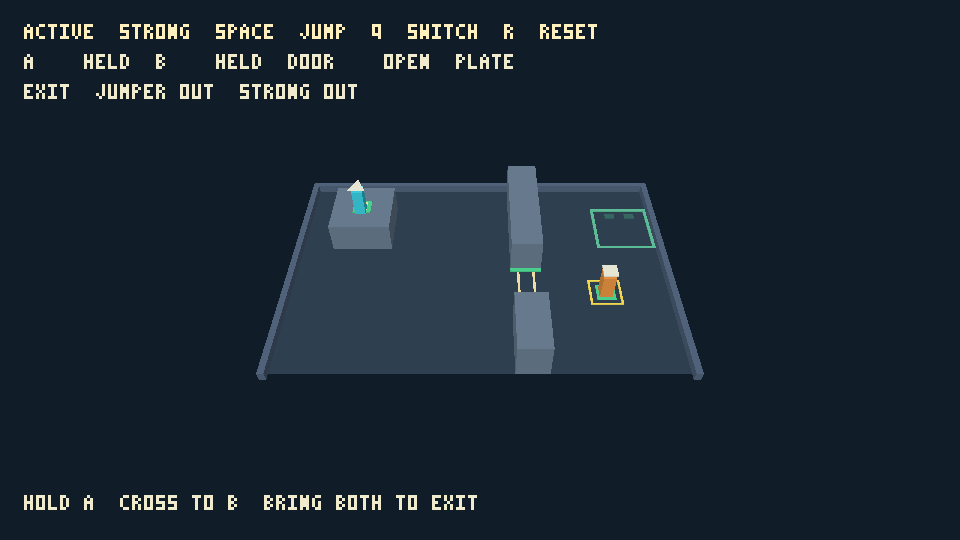
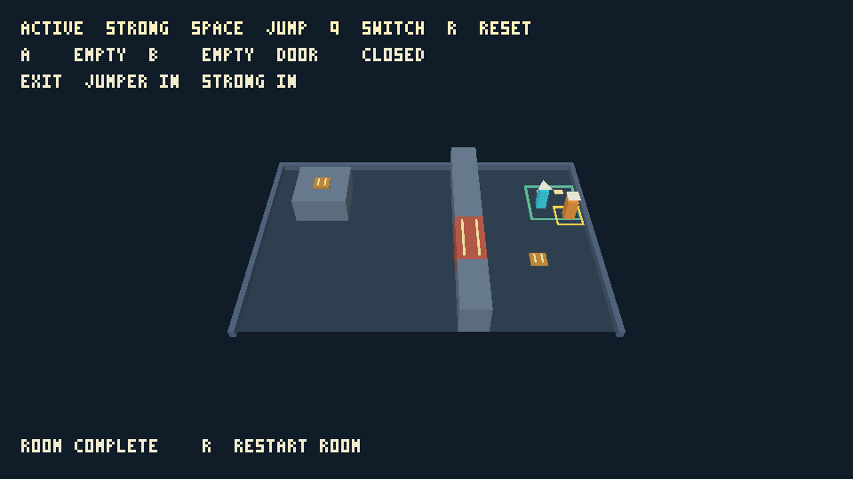
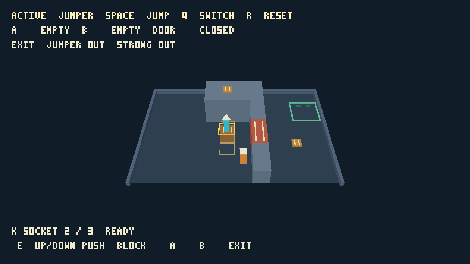
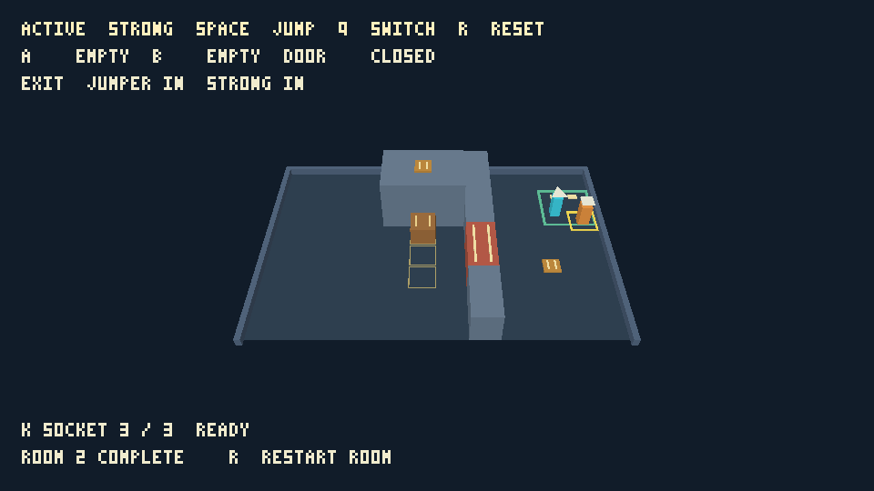

# Cooperative room verification

Issue #83 was exercised on 2026-09-06 on macOS / Apple M5 Pro. Room 1 now
replaces the earlier movement practice layout. Room 2 and block manipulation are covered below; the wider progression sequence
remains future scope.

The versioned `adventure-v3` recording contains 559 raw input frames and reaches
latched completion without fixture mutation. Its segment route holds A with
inactive Jumper, takes Strong through to B, transfers the hold to B, then brings
both complete grounded footprints into the exit. A separate replay checks every
recorded tick's complete state. The native and actual-WASM puzzle runner agrees
exactly across 24 scenarios and 1,646 states. The 34 movement scenarios and
1,363 matching states remain intact.

Adversarial checks cover Strong's height gate, solo Jumper stopping at the
full-height door after leaving A, inclusive plate center boundaries at the
correct support height, grounded versus airborne and shared occupants,
previous-tick door collision, grounded/airborne body obstruction, edge-only
clearance, simultaneous grounded complete exit footprints, completion freezing,
and full restart/recovery with queued and held input. Both characters' defensive
fall cases reconstruct the entire room. Fixture mutation is available only in
the acceptance build, never through player inspection.

The native Metal player presented 1,729 GPU frames. WebGPU and WebGL2 each
passed 111 checks in the actual browser. All three players execute the
complete route on their played simulation, capture each cooperation checkpoint,
replay to completion, verify the completion freeze, and restart. A separate
normal-input route leaves an inactive character in the doorway while releasing
the last plate, then clears the body. It verifies and captures
`open_obstructed` followed by `closed`, complementing `open_plate` on the solution.

Captures were visually inspected: both character markers remain visible, both
plates share the door's paired-stripe symbol, the open passage is clear, the
closed gate is distinct from the partitions, and the HUD reports plate states,
all three door reasons, both exit indicators and Room complete. Native OS resize
and browser presentation at 960 × 540 and 1280 × 720 pass; capture size remains
960 × 540. Direct GUI use additionally exercised Q switching, movement, pause
and R reconstruction. The browser's focused canvas and visible restart controls
use the same player state as inspection.

Selected images and their capture identity, checksum and semantic state are
retained in [puzzle evidence](evidence/puzzle-evidence.json). Full bounded local
native/browser reports complement the committed samples. The repository's
historical RPG/arena checksums and crisp README preview are unchanged.

Package formatting, all-feature tests and Clippy, native CLI, actual-WASM control,
browser key tests and the puzzle/movement runners passed. Workspace format,
tests, Clippy, core WASM and no-default-feature checks passed, as did existing
native/WASM RPG control, replay and asset loops. Required CI includes the new
puzzle conformance runner and the extended actual native GPU test.

Limits: this is a bounded prototype play/acceptance pass, not extended human
usability feedback. Release/repress switching retains the approved initial
policy and no movement values changed. The 4 m collision partitions and door
use 1.2 m visual cutaways; `puzzle_geometry` exposes their actual bounds. GPU
checksums establish consistency within a backend, not portable pixel identity.

The historical evidence below describes the earlier layouts at their revisions.

# Jumping and collision verification

Issue #82 was exercised on 2026-09-06 on macOS / Apple M5 Pro. The practice
room combines movement fixtures; it does not implement puzzle progression.
The design's movement, gravity, body/support rules and jump values are retained.
Jumper clears the 1 m teaching ledge and Strong does not. The fixed 0.75 m step
and 2 m ledge exercise the later block-assisted jump without adding block moves.

The native Metal player presented 609 GPU frames in the movement acceptance
run, including captures at Jumper's 1530 mm apex, grounded at Y=1000, Strong's
450 mm apex and blocked at the ledge face Z=3200. Inspection confirmed
support height agrees with the mesh, the active outline follows the foot height,
and both characters remain visible. Initial, repeated, reset and read-only
captures agree (`8a01b23469b2d61d` on this backend). Existing RPG/arena references
and the committed repository README preview are unchanged.

The actual browser GPU acceptance page independently passed WebGPU and WebGL2.
It exercises both apices, a teaching-ledge landing, safe walk-off, Strong's
blocked attempt, held-Space behavior, keyboard switching/release gates, replay,
reset/capture invalidation, and 960 × 540 / 1280 × 720 presentation. Browser
landing captures were visually inspected alongside the native result. These are
actual GPU/WASM checks; Node results alone do not establish browser rendering.

The optional `movement-acceptance` runner constructs isolated controlled
fixtures for positive footprint support versus edge-only contact, highest
crossed landing and nearest ceiling, high-speed obstacle sweeps, X-then-Z slide,
no step-up/coyote/buffer, both character height gates, each static block socket,
character noncollision/non-support, midair switching, and defensive below-floor
recovery of either character. `node scripts/test-movement.mjs` builds and runs
the same runner natively and in actual WASM: 34 scenarios and 1,363 complete
per-tick states matched exactly.
Inspector-path scenarios also retain held restart/jump/switch history across
restart and both recovery cases, clear future queued input, accept genuine
release/repress, and reproduce the resulting recordings.
These fixture helpers are absent from ordinary builds and introduce no player
teleport command. Both intermediate/final socket launches are accepted; the
initial socket remains too far from the high ledge even with generous edge
support. No ability-value tuning was needed.

Package formatting, tests, Clippy, native CLI, actual-WASM control and browser
key checks complement the visual checks. Workspace format/tests/Clippy/core WASM
checks and existing native/WASM RPG control, replay and asset loops also passed.
Run commands are in the [game guide](README.md). The movement conformance runner
is included in required CI, alongside the existing native player check.

Limits: this is a bounded automated prototype check, not extended human playtest
feedback. Release/repress switching remains the initial documented policy.
Jumper's narrow body is 350 mm wide inside its 400 mm collider; Strong's body
fills the shared 400 mm footprint. Both bodies are 900 mm high. Exterior walls
retain the documented cutaway treatment; foreground collision has no wall mesh.
No general physics, block pushing, plates, doors, or puzzle sequence is claimed.
GPU checksums express same-backend consistency, not a portable pixel promise.

# Control foundation verification

The control foundation was exercised on 2026-09-06 on macOS / Apple M5 Pro.
The historical section below records issue #81 before jumping was added.

The capture shows the fixed elevated camera, narrow cyan Jumper with triangle,
broad orange Strong with square, active ground outline and active-name HUD.
No foreground wall hides the starts. This is an actual native Metal capture,
not a software reference or an image generated separately from the game.

## Reproducible checks

- Package Rust tests cover axial/diagonal/opposing movement, bounds, inactive
  stationarity, input switching and repeat edges, restart precedence, recording
  limits and transactional rejection, physical aliases and focus/resume handling.
  Inspector stepping across a recorded restart retains playback; mixed step
  chunks, local stepping and timed playback agree. Explicit restart still exits
  replay, and both reset paths invalidate old capture identities.
- `scripts/test-control.py` drives the authenticated native server through the
  Titan CLI. `scripts/test-browser.mjs` runs a fresh native trace and compares
  every complete state against actual WASM executing the same 11-tick fixture.
  The final positions are Jumper `(1500,6500)`, Strong `(3500,6320)`, with Jumper
  active. Recording playback produces the same consumed input and positions.
- `scripts/test-player.py` presented native Metal GPU frames, observed an OS
  resize to 800 × 500 and zero-size suspension/recovery, and verified captures,
  read-only capture permission, session identities and interactive replay.
  Initial/repeated/reset/read-only captures share checksum `57f8d01ae2b745a4`;
  selecting Strong changes it to `45ee76242fa5818e`. These are local consistency
  checks, not a portable GPU hash contract.
- The actual browser `/play/test.html` passed separately with `backend=webgpu`
  (BrowserWebGpu) and `backend=webgl2` (Chromium ANGLE Metal, Apple M5 Pro).
  Both exercised keyboard sampling, switch suppression, 17-tick interactive
  replay, pause/resume, restart, owned asynchronous capture, capture cancellation,
  zero-size recovery, rapid release/repress between ticks, and 800 × 500 /
  960 × 540 / 1280 × 720 presentation. High-DPI requests retain proportional
  backing dimensions under the 2048-pixel allocation cap. The browser route
  ends at Jumper `(1980,6500)` and Strong `(3500,6020)`, with Strong active.
  The page displays assertions and provides identity-bearing capture evidence.
- Root workspace formatting, tests, Clippy and WASM core checks passed, together
  with the native and actual-WASM RPG control, replay and asset loops. Existing
  RPG references and the committed README preview were not changed.

Run commands and inspection examples are in the [game guide](README.md);
[quality gates](../../docs/implementation-plan.md) include this standalone package
in all three PR jobs. Native captures/JSON and bounded failure diagnostics are
retained under the repository's ignored `target/` directory; public review
comments identify the exact authored SHA and current CI evidence.

## Limits

Both character silhouettes and active selection have been visually inspected.
The renderer's optional fixed-aspect path preserves the existing default, while
unit tests check viewport fitting and invalid ratios. GPU image equality is
asserted only within one backend/session; no exact cross-GPU pixel claim is made.
Browser keyboard tests drive the real WASM player API and browser event adapter;
this is reproducible runtime evidence, not an extended human usability study.
The release-gating choice remains the documented initial prototype policy.
No other operating system or hardware performance claim is established here.

## Combined-abilities room (#84)

Room 2 was verified on 2026-09-06 on macOS / Apple M5 Pro. It is available through
explicit practice-room selection; the full start/Continue/Play again sequence
remains #85 scope. The initial block socket cannot reach the high ledge, even
from the most generous supported north edge. Native and actual-WASM acceptance
agree exactly across 27 scenarios and 2,650 states. Both normal-input solutions
complete: one push reaches the intermediate socket, and two reach the final
socket. Each mounts the block with Jumper, reaches plate A, exchanges the door
hold at B, and brings both characters to the exit.

The scenarios also cover ordered rejection reasons, grounded stance, cancelled
opposing directions, jump-plus-push, swept and destination body obstruction,
exact face contact versus 1 mm overlap, airborne clearance, occupied support,
held E and switching, intermediate reverse pushing, Strong's jump restrictions,
room-aware recording/replay, completion freeze and full room reset/recovery.
Both moved sockets use the same physical support and plate rules. No socket
flag unlocks the ledge or plate.

The actual native Metal player presented 3,543 frames; browser WebGPU and
WebGL2 each passed 177 checks. All three players execute
both complete routes, capture their push/support/plate/exit checkpoints, replay
within room 2, and reconstruct room 2 on restart. Selected PNGs and their exact
capture identity, checksum and semantic state are in
[block evidence](evidence/block-evidence.json). Inspection confirmed distinct
character markers, the raised block top and socket guides, clear A/B plate and
door states, both exit indicators and room completion text. A rejected Jumper
push visibly reports STRONG ONLY without moving the block. The camera shows
the block and ledge together; the suggested final socket route and optional
intermediate route remain visible.

An initial concurrent native/WASM control run exposed a pre-existing harness
race: its discovery wait accepted another live GPU instance before its own
headless host registered. The adventure harnesses now wait for their own
instance ID and check only their own registration on cleanup. This changes
acceptance orchestration, not game or discovery behavior. The first macOS CI run
hit the generic 60-second owned-host deadline partway through the second route.
The GPU harness now defaults to a bounded 240-second runtime budget, preserving
explicit environment overrides and normal owned-process cleanup.

Room 1's versioned recording and all movement/puzzle checks remain intact.
Workspace gates and existing native/actual-WASM RPG control, replay and asset
loops passed. The new block conformance runner is part of required WASM CI;
the extended native GPU harness remains in the macOS job. Historical RPG/arena
checksums and the committed crisp README preview are unchanged.

These are deterministic prototype and platform-integration checks, not a human
usability study or a new platform claim. The 100 mm push-stance tolerance,
release/repress gesture and fixed camera remain prototype defaults. Independent
whole-slice playtesting follows in #86.
